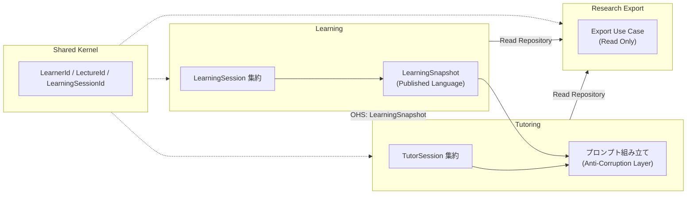

# ドメインモデル

## 変更理由（Why）

- LAD と LLM チューターが同じ学習データの **dict 束** に依存しており、意味の共有と拡張（複数講義・長期実験）が困難
- 研究 RQ に沿った対話支援を、講義単位で一貫して記述・分析できるモデルが必要
- 近い実験（1 人・1 教材・1 振り返り）と将来（15 講義・講義内の自由往復）を**同一モデル**で表現する
- LAD（学習記録）と LLM チューター（対話）の責務を**境界づけられたコンテキスト**で分離し、拡張時の結合度を下げる

## 研究コンテキスト（スコープ）

**RQ（要約）**: LAD データと小テスト結果を用いた LLM チューター対話は、AI 生成の解釈を早期に固定せず、学習者が自身の違和感・選択理由・教材証拠・学習過程を結びつけた**暫定的な解釈**を外化することを支援できるか。

- **暫定的な解釈**: 「この結果や違和感は、こういう見え方や学習過程と関係していそうだ」と、学習者自身が暫定的に言語化できている状態
- **スコープ内**: 講義単位の学習過程・小テスト・教材証拠・対話履歴に基づく支援
- **スコープ外**: 原因帰属、方略形成
- **AI コンテキスト**: 講義単位（1 LearningSession のみ）。15 講義の変化分析は研究側（エクスポート後）で行う

## 学習フロー（ドメイン上の解釈）

1 講義あたり 1 つの `LearningSession` の中で、教材動画・小テスト・LAD・AI 振り返りを**自由に往復**できる。
往復は UI の関心であり、ドメインでは **同一 Session への追記**として記録する。

```
教材動画 ⇄ 小テスト ⇄ LAD / AI 振り返り ⇄ 教材動画 …
         （すべて同一 LearningSession 内）
```

## 境界づけられたコンテキスト

本システムは **3 つの境界づけられたコンテキスト** と **1 つの共有カーネル** で構成する。
各コンテキストは独自のユビキタス言語と集約境界を持ち、他コンテキストの内部モデルを直接参照しない。

### コンテキスト一覧

| コンテキスト    | 英名            | コアドメイン   | 主な責務                                                          |
| --------------- | --------------- | -------------- | ----------------------------------------------------------------- |
| 学習記録        | Learning        | はい           | 講義定義・視聴・小テスト・1 講義あたり 1 Session の学習過程を記録 |
| AI 振り返り支援 | Tutoring        | はい           | 1 LearningSession スコープの LLM 対話で暫定的な解釈の外化を支援   |
| 研究データ出力  | Research Export | いいえ（支援） | 参加者・講義横断の分析用データを Read 中心で出力                  |
| （共有）        | Shared Kernel   | —              | 全コンテキストが合意する識別子・参加者参照                        |

**LAD（学習分析ダッシュボード）** は独立したコンテキストではない。Learning コンテキストの **Read Model（LearningSnapshot）** を UI が表示する。

---

### Learning（学習記録）

**目的**: 学習者が 1 講義の中で行った行動（視聴・小テスト）を、再現可能な形で記録する。

**ユビキタス言語**

| 用語           | 意味                                                      |
| -------------- | --------------------------------------------------------- |
| 学習セッション | 1 学習者 × 1 講義 × 1 試行の学習記録（`LearningSession`） |
| 視聴イベント   | 動画操作 1 回分の記録（`ViewingEvent`）                   |
| 小テスト受験   | 1 回の受験と得点（`QuizAttempt`）                         |
| 講義           | 動画・字幕・小テスト定義の単位（`Lecture`）               |

**所有する概念**

- 集約: `LearningSession`（Root）, `Lecture`
- 子 Entity: `ViewingEvent`, `QuizAttempt`, `QuizAnswer`
- 任意: `ParticipantProgram`（長期研究の束ね）
- Read Model: `LearningSnapshot`（LAD 表示・他コンテキストへの公開契約）

**不変条件（コンテキスト境界）**

- 同一 `(learnerId, lectureId)` の `LearningSession` は 1 つまで
- 視聴・小テストの追記は `LearningSession` 集約ルート経由のみ
- `LearningSnapshot` のスコープは常に 1 `LearningSession`

**スコープ外**

- LLM プロンプト設計、対話メッセージの意味解釈
- 講義横断の統計・因果分析

**他コンテキストへの公開**

- `LearningSnapshot` を **Published Language** として Tutoring に提供する
- Research Export は Learning の Repository を Read のみ参照する

---

### Tutoring（AI 振り返り支援）

**目的**: 1 講義分の学習データと対話履歴に基づき、学習者が**暫定的な解釈**を自身の言葉で外化できるよう LLM 対話を記録・継続する。

**ユビキタス言語**

| 用語                 | 意味                                                                                         |
| -------------------- | -------------------------------------------------------------------------------------------- |
| チューターセッション | 1 `LearningSession` に紐づく AI 振り返り対話（`TutorSession`）                               |
| メッセージ           | user / assistant の 1 発話（`Message`）                                                      |
| 暫定的な解釈         | 学習者が違和感・選択理由・教材証拠・学習過程を結びつけて言語化した状態（研究 RQ の成果指標） |

**所有する概念**

- 集約: `TutorSession`（Root）— 論理的には `LearningSession` の子だが、**永続化・ユースケースは Tutoring コンテキストが担当**
- 子 Entity: `Message`

**不変条件（コンテキスト境界）**

- 1 `LearningSession` に `TutorSession` は 1 本まで
- 講義内で LAD/AI に何度戻っても `TutorSession` は新規作成せず `Message` を追記
- AI プロンプトに載せる学習データは **1 `LearningSession` スコープ**（他講義を混ぜない）

**スコープ外**

- 視聴ログ・小テストの記録（Learning に委譲）
- 原因帰属の確定、方略形成の評価（研究 RQ スコープ外）
- 15 講義横断の変化分析（Research Export / 研究側）

**他コンテキストとの関係**

- Learning から `LearningSnapshot` を受け取る（Customer）。Learning の用語を Tutoring 内部に持ち込まない
- 対話履歴は Tutoring コンテキストのみが書き込む（既存 `tutor.db`）

---

### Research Export（研究データ出力）

**目的**: 実験終了後または長期プログラム（15 講義等）において、分析者が参加者単位・講義横断でデータを取得する。

**ユビキタス言語**

| 用語           | 意味                                                              |
| -------------- | ----------------------------------------------------------------- |
| エクスポート   | 分析用 TSV/JSON 等への一括出力                                    |
| プログラム参加 | 同一参加者の複数講義 Session を束ねる文脈（`ParticipantProgram`） |

**所有する概念**

- 現時点では永続 Entity を新設しない（Phase 7 で Export Use Case の骨格）
- 入力は Learning / Tutoring の Read 専用 Repository

**不変条件（コンテキスト境界）**

- Export は **書き込みを行わない**（Read 中心）
- エクスポート行は `(learnerId, learningSessionId)` で Learning / Tutoring データを結合可能であること

**スコープ外**

- リアルタイム LAD 表示、LLM 対話の生成

---

### Shared Kernel（共有カーネル）

全コンテキストが **同一の識別子** を使う最小集合。実装は `domain/shared/` に置く。

| 概念                    | 役割                                                  |
| ----------------------- | ----------------------------------------------------- |
| `Learner` / `LearnerId` | 参加者の同一性（既存 API: `participant_id`）          |
| `LectureId`             | 講義の参照                                            |
| `LearningSessionId`     | 1 試行の学習記録の参照（Tutoring・Export の外部キー） |
| 各種 ID Value Object    | 空文字拒否等の共通不変条件                            |

Shared Kernel は **振る舞いを持たない識別子と参加者参照** に限定する。`LearningSession` 集約のルールは Learning が所有する。

---

### コンテキストマップ



| 関係                                  | パターン                               | 説明                                                                                   |
| ------------------------------------- | -------------------------------------- | -------------------------------------------------------------------------------------- |
| Learning → Tutoring                   | Open Host Service + Published Language | `LearningSnapshot` のみを公開 API とする                                               |
| Tutoring ← Learning                   | Customer + ACL                         | プロンプト構築は Tutoring 側 Presenter が担当。Learning の Entity を直接 import しない |
| Research Export ← Learning / Tutoring | Conformist（Read）                     | 既存 Repository を Read 専用で参照。Export 用 DTO は Export コンテキストで定義         |
| 全コンテキスト                        | Shared Kernel                          | ID 型と `Learner` 参照を共有                                                           |

**インフラ上の DB 分割**（ADR 準拠）とコンテキストの対応:

| DB           | コンテキスト    | テーブル例                                     |
| ------------ | --------------- | ---------------------------------------------- |
| 学習データ用 | Learning        | learning_sessions, viewing_logs, quiz_attempts |
| 対話用       | Tutoring        | sessions, messages                             |
| —            | Research Export | 永続化なし（Export 時に結合）                  |

---

## Learning コンテキスト

### モデル図

```
Learner                          Lecture
  id                               id, title, videoUrl, srtPath
                                   quizDefinition (QuizDefinition)
                                        └ Question[]

ParticipantProgram（任意）           Question: index, text, choices, correctAnswer
  id, learnerId, programId, startedAt

LearningSession（Aggregate Root）
  id, learnerId, lectureId, startedAt
  participantProgramId（任意・nullable）
  ├ ViewingEvent[]
  └ QuizAttempt[]
       └ QuizAnswer[]

LearningSnapshot（Read Model・Entity ではない）
  sessionId, learnerId, lectureId
  viewingEvents, latestQuizAttempt, quizAnswers
  lectureTranscriptExcerpts（任意）
```

### トップレベル Entity

> `Learner` は Shared Kernel。Learning / Tutoring / Research Export から参照する。

### Learner（学習者）— Shared Kernel

| フィールド | 型        | 説明               |
| ---------- | --------- | ------------------ |
| id         | LearnerId | 学習者を一意に識別 |

**不変条件**

- `id` は空文字でない
- `id` はシステム内で一意

**備考**

- HTTP API では `participant_id` として受け取り、`learning_sessions.learner_id` として永続化する（[framework-drivers-persistence.md](./framework-drivers-persistence.md)）

---

### Lecture（講義）

| フィールド     | 型             | 説明                                                                      |
| -------------- | -------------- | ------------------------------------------------------------------------- |
| id             | LectureId      | 講義を一意に識別                                                          |
| title          | str            | 表示・エクスポート用                                                      |
| videoUrl       | str            | 動画 URL                                                                  |
| srtPath        | str            | 講義字幕ファイルへのパス                                                  |
| quizDefinition | QuizDefinition | 小テスト定義                                                              |
| outline        | LectureOutline | 講義構造メタデータ（ITS Domain Model / 知識ベース）。未設定時は空 Outline |

**不変条件**

- `id` は一意
- `quizDefinition` は講義に 1 つ
- `videoUrl` と `quizDefinition` は空でない（講義として有効であること）

**備考**

- LAD 学習者タイプ判定時、interfaces 層の `VideoDurationResolver`（Infrastructure 実装）が `videoUrl` を参照して動画総尺を解決する（解決方法の How は infrastructure 実装に委ねる）
- `outline` は ITS チューターのプロンプトに注入する静的知識。近い実験では `framework_drivers/db/learning/lecture_outlines/` から注入する

---

### LectureOutline（ITS Domain Model / 知識ベース）

講義動画の章構成・動画内演習・小テスト採点意図を表す Value Object 群。LLM 呼び出しは行わない。

#### LectureSection

| フィールド | 型          | 説明                             |
| ---------- | ----------- | -------------------------------- |
| id         | str         | セクション識別子（講義内で一意） |
| title      | str         | セクション名                     |
| startSec   | int         | 動画内開始位置（秒）             |
| endSec     | int \| None | 動画内終了位置（秒・任意）       |
| summary    | str \| None | 概要（任意）                     |

#### InVideoExercise

| フィールド       | 型          | 説明                       |
| ---------------- | ----------- | -------------------------- |
| id               | str         | 演習識別子（講義内で一意） |
| title            | str         | 演習名                     |
| timestampSec     | int         | 動画内タイムスタンプ（秒） |
| description      | str         | 演習の説明                 |
| relatedSectionId | str \| None | 関連セクション ID（任意）  |

#### QuizRubricNote

| フィールド    | 型  | 説明                                        |
| ------------- | --- | ------------------------------------------- |
| questionIndex | int | 設問番号（Lecture.quizDefinition への参照） |
| note          | str | 採点意図・よくある誤解                      |

#### LectureOutline

| フィールド       | 型                | 説明                                   |
| ---------------- | ----------------- | -------------------------------------- |
| sections         | LectureSection[]  | 講義セクション一覧                     |
| inVideoExercises | InVideoExercise[] | 動画内演習一覧                         |
| quizRubricNotes  | QuizRubricNote[]  | 小テスト採点意図（任意・デフォルト空） |

**不変条件**

- `LectureSection.id` / `InVideoExercise.id` は同一 `LectureOutline` 内でそれぞれ一意
- `startSec` / `timestampSec` は 0 以上
- `endSec` が指定される場合、`endSec > startSec`
- 空 Outline（`sections`・`inVideoExercises`・`quizRubricNotes` すべて空）は後方互換のデフォルトとして許容する

---

### LearningSession（Aggregate Root）

1 学習者 × 1 講義 × 1 試行（1 来室・1 実験単位）の学習記録。

| フィールド           | 型                           | 説明                   |
| -------------------- | ---------------------------- | ---------------------- |
| id                   | LearningSessionId            | セッション ID          |
| learnerId            | LearnerId                    | 学習者                 |
| lectureId            | LectureId                    | 講義                   |
| startedAt            | datetime                     | 開始日時               |
| participantProgramId | ParticipantProgramId \| None | 長期プログラム（任意） |

**不変条件**

- `learnerId` と `lectureId` は作成後変更不可
- 同一 `(learnerId, lectureId)` の LearningSession は **1 つまで**
- 子 Entity（ViewingEvent, QuizAttempt）は必ずこの Session に属する
- 子 Entity を Session 外から直接作成・変更しない（集約ルート経由）

**他コンテキストとの参照**

- `LearningSessionId` は Tutoring の `TutorSession` が外部キーとして参照する（集約は分割）
- Tutoring の不変条件「1 LearningSession に TutorSession 1 本」は Tutoring コンテキストが enforce する

**近い実験の運用**

- 1 人・1 教材・1 振り返り: Session 1、TutorSession 1
- 制限はユースケース層のポリシーで enforce 可能（モデル自体は将来拡張を許容）

---

### ParticipantProgram（任意）

15 講義など、同一参加者の長期研究文脈を束ねる。

| フィールド | 型                   | 説明              |
| ---------- | -------------------- | ----------------- |
| id         | ParticipantProgramId | プログラム参加 ID |
| learnerId  | LearnerId            | 学習者            |
| programId  | ProgramId            | コース定義 ID     |
| startedAt  | datetime             | 参加開始          |

**不変条件**

- 同一 `(learnerId, programId)` の参加は 1 つまで
- 配下の LearningSession はすべて同じ `participantProgramId` を持つ（設定する場合）

**備考**

- 近い実験（1 講義のみ）では未使用可。Phase 6 以降で導入

---

### LearningSession 配下の Entity

### ViewingEvent（視聴イベント）

| フィールド    | 型             | 説明                                 |
| ------------- | -------------- | ------------------------------------ |
| id            | ViewingEventId | イベント ID                          |
| occurredAt    | datetime       | 操作が記録された壁時計時刻           |
| videoPosition | int            | 動画内位置（秒）                     |
| action        | ViewingAction  | 操作種別                             |
| positionDelta | int            | 前位置からの変位（秒・符号付き整数） |

**ViewingAction（列挙）**

- `play`
- `pause`
- `forward_skip`
- `backward_skip`
- `forward_seek`
- `backward_seek`

**不変条件**

- `videoPosition >= 0`
- `positionDelta` は符号付き整数（秒）
- ingress（API 等）で受け取った小数秒は **0 方向へ切り捨て**て整数化してからドメインに渡す
- `action` が `play` または `pause` のとき、`positionDelta == 0`
- `action` が `forward_skip` または `forward_seek` のとき、`positionDelta > 0`（動画端で 0 になる edge case は許容）
- `action` が `backward_skip` または `backward_seek` のとき、`positionDelta < 0`（動画端で 0 になる edge case は許容）

**インフラマッピング**

| ドメイン      | 既存 DB / API |
| ------------- | ------------- |
| occurredAt    | time_stamp    |
| videoPosition | current_time  |
| action        | action        |
| positionDelta | duration      |

---

### QuizAttempt（小テスト受験）

| フィールド       | 型            | 説明       |
| ---------------- | ------------- | ---------- |
| id               | QuizAttemptId | 受験 ID    |
| attemptedAt      | datetime      | 受験日時   |
| scoreNumerator   | int           | 得点       |
| scoreDenominator | int           | 満点       |
| answers          | QuizAnswer[]  | 各問の回答 |

**不変条件**

- LearningSession に 1 つ以上属しうる（再受験時は複数 Attempt）
- `0 <= scoreNumerator <= scoreDenominator`
- `scoreDenominator > 0`
- `answers` は 1 件以上（講義の設問数と一致することが望ましい）

---

### QuizAnswer（小テスト回答）

| フィールド     | 型   | 説明                                        |
| -------------- | ---- | ------------------------------------------- |
| questionIndex  | int  | 設問番号（Lecture.quizDefinition への参照） |
| selectedAnswer | str  | 学習者の選択                                |
| isCorrect      | bool | 正誤                                        |

**不変条件**

- `questionIndex` は同一 QuizAttempt 内で一意
- `questionIndex` は Lecture.quizDefinition に存在する設問を指す
- 問題文・選択肢・正解の**定義**は Lecture 側に持つ（Attempt には回答結果のみ）

---

### Read Model: LearningSnapshot

LAD 表示および Tutoring への **Published Language**。**Entity ではない**。

| フィールド                | 説明                                |
| ------------------------- | ----------------------------------- |
| sessionId                 | 対象 LearningSession                |
| learnerId                 | 学習者                              |
| lectureId                 | 講義                                |
| viewingEvents             | 時系列の視聴イベント                |
| latestQuizAttempt         | 最新の QuizAttempt（なければ null） |
| quizAnswers               | latestQuizAttempt に紐づく回答      |
| lectureTranscriptExcerpts | 視聴位置に対応する字幕抜粋（任意）  |

**不変条件（意味的）**

- スコープは **1 LearningSession のみ**（他講義のデータを含めない）
- 組み立て元は LearningSession 集約と Lecture 定義

**組み立て**

- Domain Service `LearningSnapshotBuilder`（Learning コンテキスト）が LearningSession + Lecture から生成

---

### Value Object（Learning）

| 名前            | 説明                                   | 不変条件                             |
| --------------- | -------------------------------------- | ------------------------------------ |
| ViewingAction   | 視聴操作                               | 列挙値のみ                           |
| QuizDefinition  | 小テスト定義                           | questions が 1 件以上                |
| Question        | 設問                                   | index 一意、text 非空                |
| LectureOutline  | 講義構造メタデータ（ITS Domain Model） | section / exercise id 一意、秒数非負 |
| LectureSection  | 講義セクション                         | id・title 非空                       |
| InVideoExercise | 動画内演習                             | id・title・description 非空          |
| QuizRubricNote  | 小テスト採点意図                       | questionIndex >= 1、note 非空        |

識別子（`LectureId`, `LearningSessionId` 等）は Shared Kernel を参照する。

---

### Domain Service（Learning）

| 名前                    | 責務                                                          |
| ----------------------- | ------------------------------------------------------------- |
| LearningSnapshotBuilder | LearningSession と Lecture から LearningSnapshot を組み立てる |

---

## Tutoring コンテキスト

### モデル図

```
TutorSession（Aggregate Root）
  id, learningSessionId, startedAt
  └ Message[]
```

`learningSessionId` は Shared Kernel の `LearningSessionId` を参照する。Learning 集約の内部状態は直接持たない。

### TutorSession（AI 振り返り）

| フィールド        | 型                | 説明                                  |
| ----------------- | ----------------- | ------------------------------------- |
| id                | TutorSessionId    | 対話セッション ID                     |
| learningSessionId | LearningSessionId | 紐づく学習セッション（Shared Kernel） |
| startedAt         | datetime          | 開始日時                              |

**不変条件**

- 1 LearningSession に TutorSession は **1 本まで**
- 講義内で LAD/AI に何度戻っても TutorSession は新規作成しない（Message を追記）

---

### Message（対話メッセージ）

| フィールド          | 型                                | 説明                                                            |
| ------------------- | --------------------------------- | --------------------------------------------------------------- |
| id                  | MessageId                         | メッセージ ID                                                   |
| role                | MessageRole                       | `user` または `assistant`                                       |
| content             | str                               | 発話内容                                                        |
| createdAt           | datetime                          | 作成日時                                                        |
| utteranceType       | `LearnerUtteranceType \| None`    | 当ターンの user 発話分類（assistant のみ。研究ログ用）          |
| dialogueMove        | `DialogueMove \| None`            | 当ターンに選択した Coach Move（assistant のみ）                 |
| interpretationState | `InterpretationStateCard \| None` | 当ターン時点の State Card（assistant のみ。ターン間引き継ぎ用） |

**不変条件**

- `role` は `user` または `assistant` のみ
- `content` は空文字でない
- 1 Message は 1 発話（user と assistant を 1 行にペアリングしない）
- `utteranceType` / `dialogueMove` / `interpretationState` は **assistant Message のみ** に付与する。user Message では常に `None`
- 初回ターン・半角数字のみ定型文など LLM 未呼び出し時は assistant の付帯メタデータはすべて `None`

**State Card ターン間引き継ぎ**

- 2 ターン目以降の ITS Student Model 入力には、直前 assistant Message の `interpretationState` を渡す
- 初回ターンまたは直前 assistant に State Card が無い場合は `InterpretationStateCard.empty()` 相当で開始する

**インフラマッピング**

- 既存 `messages` テーブル（`session_id`, `role`, `content`, `created_at`）に加え、`utterance_type` / `dialogue_move` / `interpretation_state`（JSON）列で付帯メタデータを永続化する（[framework-drivers-persistence.md](./framework-drivers-persistence.md)）
- 既存 `sessions` テーブルは TutorSession に対応（`learning_session_id` 列 — [framework-drivers-persistence.md](./framework-drivers-persistence.md)）

---

### Tutoring Value Object（ITS パイプライン）

| 名前                          | 説明                                              | 不変条件                                   |
| ----------------------------- | ------------------------------------------------- | ------------------------------------------ |
| `MessageRole`                 | 発話者                                            | `user` \| `assistant`                      |
| `InterpretationFieldStatus`   | State Card 各軸の確信度                           | `confirmed` \| `hypothesized` \| `unknown` |
| `InterpretationField`         | State Card の 1 軸（status + note）               | —                                          |
| `InterpretationStateCard`     | 8 軸の学習者解釈状態カード                        | 8 軸すべて必須。`empty()` は全軸 `unknown` |
| `LearnerUtteranceType`        | 学習者発話分類（5 種）                            | `FACT_REQUEST` 等                          |
| `DialogueMove`                | Coach Move（13 種）                               | プロンプト定義と列挙が一致すること         |
| `ResponseBudget`              | 発話予算（max_sentences, max_questions）          | 正の整数                                   |
| `DialogueMoveDecision`        | Pedagogical Model 出力（Move + budget + 指示）    | `interface_instructions` は空でない        |
| `LearnerInterpretationResult` | Student Model 出力（utterance_type + state_card） | —                                          |

配置: `domain/tutoring/`。Application 層 DTO（`TutoringPipelineRequest` 等）とは分離する。

**用語の区別**: 本節の ITS 4 部モデル名（Domain Model / Student Model 等）はクリーンアーキテクチャの層名とは別概念である（[application-usecase.md](./application-usecase.md) の ITS パイプライン参照）。

---

### Value Object（Tutoring）— 旧表（MessageRole のみ）

| 名前        | 説明   | 不変条件              |
| ----------- | ------ | --------------------- |
| MessageRole | 発話者 | `user` \| `assistant` |

（上記「Tutoring Value Object」節に VO 一覧を統合。本表は後方参照用に残す。）

---

### Domain Service（Tutoring）

| 名前                     | 責務                                                |
| ------------------------ | --------------------------------------------------- |
| NearTermExperimentPolicy | 近い実験向け制約（例: TutorSession 1 本まで）の判定 |

プロンプト文字列の組み立ては **interfaces 層の Presenter**（Anti-Corruption Layer）が担当し、入力は `LearningSnapshot` + `Message[]` とする。

---

## Research Export コンテキスト

### モデル（Phase 7）

永続 Entity は現時点で定義しない。Export Use Case が Learning / Tutoring の Read Repository から DTO を組み立てる。

**受入時に満たす条件**

- 1 行が `(learnerId, learningSessionId, lectureId)` で Learning データと Tutoring データを結合できる
- Export 処理は Learning / Tutoring の集約を変更しない

---

## Shared Kernel — Value Object

| 名前              | 説明              | 不変条件   |
| ----------------- | ----------------- | ---------- |
| LearnerId         | 学習者 ID         | 空文字不可 |
| LectureId         | 講義 ID           | 空文字不可 |
| LearningSessionId | 学習セッション ID | 空文字不可 |

---

## コンテキスト横断（参考）

Domain Service は状態を持たない。Entity / VO 単体では表現しにくいルールと組み立てロジックを担う。

---

## 既存システムとの対応

| 現行                                                                    | ドメイン上の位置                                                                                                                                |
| ----------------------------------------------------------------------- | ----------------------------------------------------------------------------------------------------------------------------------------------- |
| `db/schema.sql` sessions, messages                                      | TutorSession, Message（`learning_session_id` で LearningSession 参照 — [framework-drivers-persistence.md](./framework-drivers-persistence.md)） |
| `db/schema_learning.sql` learning_sessions, viewing_logs, quiz_attempts | LearningSession, ViewingEvent, QuizAttempt                                                                                                      |
| `get_lad_data_for_participant`                                          | LearningSnapshotBuilder の出力に相当                                                                                                            |
| `app/main.py` `_format_*`                                               | Presenter 層（ドメイン外）                                                                                                                      |

---

## 受入基準（ドメインモデル全体）

**境界づけられたコンテキスト**

- [ ] コード上で Learning / Tutoring / Research Export のパッケージまたはモジュール境界が識別できる
- [ ] Tutoring が Learning の Entity を直接 import せず、`LearningSnapshot` 経由で学習データを参照する
- [ ] `LearningSessionId` が Shared Kernel として両コンテキストで同一型である

**Learning**

- [ ] トップレベル Entity が Learner, Lecture, LearningSession として存在する
- [ ] LearningSession 配下に ViewingEvent, QuizAttempt, QuizAnswer が存在する
- [ ] ViewingEvent.positionDelta が負の値を許容し、backward_skip / backward_seek で検証される
- [ ] 小テストの設問定義は Lecture 側、受験結果は QuizAttempt / QuizAnswer 側に分離されている
- [ ] LearningSnapshot は 1 LearningSession スコープであることが型またはドキュメントで明示されている

**Tutoring**

- [ ] TutorSession が `learningSessionId` で Learning を参照する
- [ ] Message は role + content の 1 発話モデルである
- [ ] assistant Message に `utteranceType` / `dialogueMove` / `interpretationState` を付帯できる（user は常に `None`）
- [ ] 直前 assistant の `interpretationState` が次ターン Student Model 入力に引き継がれる
- [ ] NearTermExperimentPolicy が TutorSession 1 本制約を Tutoring 側で enforce する
