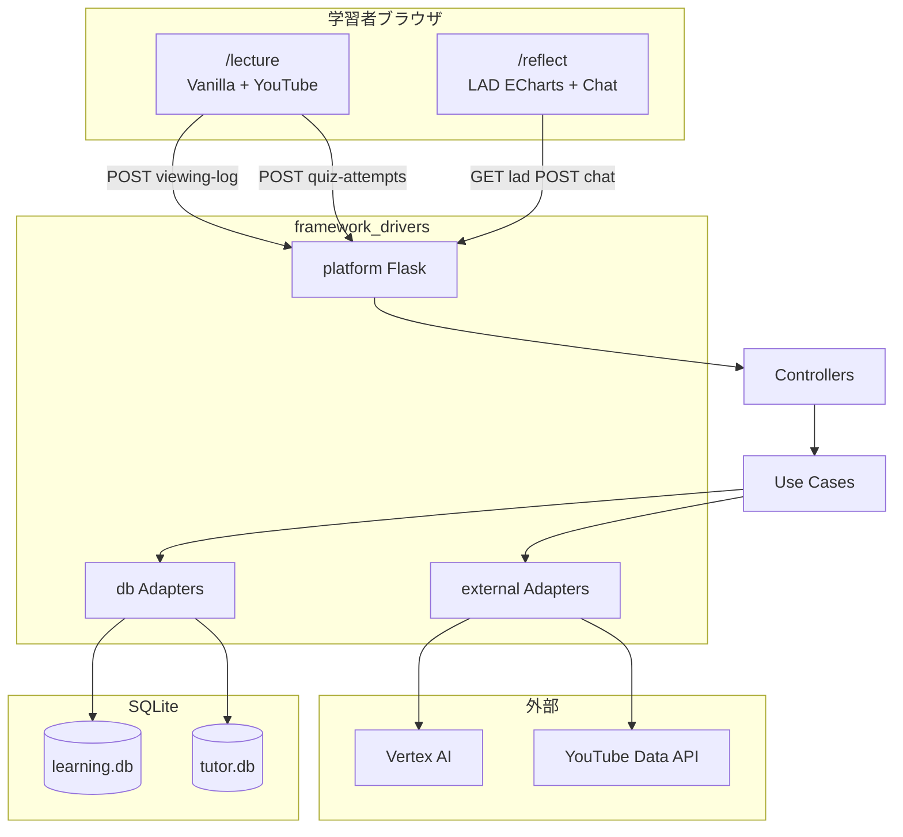
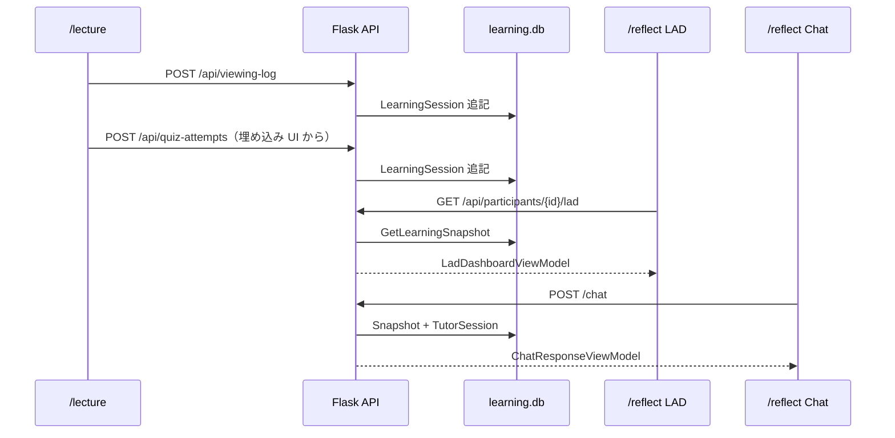

# Framework & Drivers 層

## 変更理由（Why）

- [interfaces-layer.md](./interfaces-layer.md) まで **Controller → Use Case → Presenter → ViewModel** の契約は確立済み。次は **Port の具象実装・HTTP 配線・フロント配信・外部連携** を Framework & Drivers 層として仕様化し、Looker Studio 手動 CSV 経由を廃止して **学習直後に LAD と AI が同一学習コンテキストを参照**できるようにする
- [ADR_SSSRL-backend_2026-02-23.md](../../Arcitecture/ADR_SSSRL-backend_2026-02-23.md) は Flask + SQLite 2 DB・Spreadsheet 非参照を決定済み。本仕様は **フロント技術選定** と **講義動画のホスティング方針の更新**（GAS → Flask）・**3 講義カタログ** を追記し、検討結果を1箇所に構造化する
- 第一目的は **人手介入なしでログを DB に記録し、LAD 表示と AI プロンプトに反映**することである。フレームワーク選定はこの目的から逆算する

## スコープ

### 本仕様に含める

| 要素                  | 説明                                                                              |
| --------------------- | --------------------------------------------------------------------------------- |
| 層の責務              | `framework_drivers/`（platform / db / external）・移行期間中の `app/`・`db/`      |
| 技術選定              | 講義動画・LAD+AI 統合画面・バックエンドランタイム・永続化・外部連携               |
| 全体トポロジ          | 参加者導線・Write / Read 経路・DB 参照範囲                                        |
| Port → Adapter 対応表 | Application Port と Framework & Drivers 具象の 1:1                                |
| HTTP / ページ契約     | API ルート・HTML ページ（Flask 配信）                                             |
| 環境・運用の What     | 必須環境変数、デプロイ単位、永続化要件                                            |
| ADR との差分          | 講義動画ホスティング（GAS → Flask 配信）・小テスト入力（GAS → Flask API）・3 講義 |

### 本仕様に含めない（別仕様・別 PR）

- Use Case 手順・Port インターフェース定義（[application-usecase.md](./application-usecase.md)）
- ViewModel・ingress 規約（[interfaces-layer.md](./interfaces-layer.md)）
- Mapper / SQL の実装詳細（[framework-drivers-implementation-plan.md](./framework-drivers-implementation-plan.md) の各 Phase）
- LAD 固定文・Looker 互換 UI の CSS 詳細
- Research Export
- 認証必須化（ADR: 任意。将来拡張）

## 関連仕様

- ADR: [ADR_SSSRL-backend_2026-02-23.md](../../Arcitecture/ADR_SSSRL-backend_2026-02-23.md)
- ドメインモデル: [domain-model.md](./domain-model.md)
- アプリケーション層: [application-usecase.md](./application-usecase.md)
- interfaces 層: [interfaces-layer.md](./interfaces-layer.md)
- 段階的実装計画: [framework-drivers-implementation-plan.md](./framework-drivers-implementation-plan.md)
- 学習データ永続化（SQLite 草案）: [framework-drivers-persistence.md](./framework-drivers-persistence.md)

### 層の対応（クリーンアーキテクチャ）

| パス                          | 層                         | 役割                                                           |
| ----------------------------- | -------------------------- | -------------------------------------------------------------- |
| `domain/`                     | Enterprise Business Rules  | 集約・不変条件                                                 |
| `application/`                | Application Business Rules | Use Case・Port 定義                                            |
| `interfaces/`                 | Interface Adapters         | Controller / Presenter / ViewModel                             |
| `framework_drivers/`          | Framework & Drivers        | Port 具象・Flask 配線・外部 API（**層名: framework-drivers**） |
| `framework_drivers/platform/` | Framework & Drivers        | Flask ルート・Composition Root・HTML / 静的 JS 配信            |
| `framework_drivers/db/`       | Framework & Drivers        | SQLite Repository・Mapper                                      |
| `framework_drivers/external/` | Framework & Drivers        | YouTube Data API・Vertex AI 等                                 |

**ディレクトリ命名**: 層・ドキュメント上の名称は **framework-drivers**。Python import 可能なパッケージ名は **`framework_drivers/`**（ハイフンは識別子に使えないため）。

ルートの `db/` は移行期間中の旧 Repository 実装を含む。目標は **`framework_drivers/db/` に Mapper / Repository を集約**し、`app/main.py` から `db/` 直参照を廃止することである。移行完了まで `app/` は `framework_drivers/platform/` へ段階的に移す。

---

## パッケージ構成（framework-drivers）

```
framework_drivers/
  platform/                    # Flask・wiring・templates・static（目標）
    main.py                    # Phase 4: app/main.py から移行
    wiring.py                  # Composition Root
    templates/
      lecture.html
      reflect.html
    static/
      css/
      js/
  db/
    learning/                  # LearningSessionRepository・Mapper
    tutoring/                  # TutorSessionRepository
  external/
    youtube/                   # VideoDurationResolver（既存）
    vertex/                    # LlmGateway（目標）
```

| サブパッケージ | 責務                                          | 依存してよいもの                                                                                  |
| -------------- | --------------------------------------------- | ------------------------------------------------------------------------------------------------- |
| `platform`     | HTTP ingress / egress、HTML 配信、DI 組み立て | `interfaces/`・`application/`・`framework_drivers/db`・`framework_drivers/external`               |
| `db`           | SQLite 永続化、Port 具象                      | `domain/`・`application/`（Port 契約のみ）                                                        |
| `external`     | 外部 HTTP / SDK（YouTube・Vertex）            | `domain/`・`application/`（Port 契約のみ）・`interfaces/` の Port 実装（`VideoDurationResolver`） |

`platform` は **Flask を import してよい唯一の Framework & Drivers サブパッケージ**とする。`db` / `external` は Flask を import しない。

---

## 第一目的と設計原則

| 原則               | 内容                                                                                                                                |
| ------------------ | ----------------------------------------------------------------------------------------------------------------------------------- |
| シームレス Write   | 視聴ログ・小テスト送信後、人手（CSV アップロード等）を介さず DB に記録される                                                        |
| 共有 Read          | LAD UI と AI は **同一 `GetLearningSnapshot`**（[application-usecase.md#共有学習コンテキスト](./application-usecase.md)）を参照する |
| 同一識別子         | 動画・小テスト・LAD・AI で **`participant_id` を共通**とする                                                                        |
| ingress 契約の安定 | 外部 JSON 形状（API 契約テスト）は維持し、ホスティング変更のみ許容する                                                              |
| 近い実験の単純さ   | **3 講義**（`participant_id` で自動解決）・Flask モノリス・SQLite 2 ファイルで完結する                                              |

---

## 技術選定（確定）

### フロントエンド

| 画面                | URL（目標）       | 技術                                       | 備考                                                                  |
| ------------------- | ----------------- | ------------------------------------------ | --------------------------------------------------------------------- |
| 講義動画 + 小テスト | `GET /lecture`    | **Vanilla JS + HTML + YouTube IFrame API** | 動画プレイヤー直下に埋め込み小テスト UI（`lecture.html` + `quiz.js`） |
| LAD + AI 振り返り   | `GET /reflect`    | **Vanilla JS + HTML + CSS**                | 1 画面に LAD とチャットを統合                                         |
| LAD グラフ          | （`/reflect` 内） | **ECharts（CDN）**                         | 円グラフ・グループ化棒グラフのみ                                      |
| AI チャット         | （`/reflect` 内） | **Vanilla JS**（DOM + `fetch`）            | ECharts は使用しない                                                  |

フロントに React / Vue 等の SPA フレームワークは **採用しない**。ビルドステップは不要とする。

LAD の補助テキスト（振り返るポイント・操作名対訳等）は **固定文** とし、フロントの定数または HTML に保持する。API（`LadDashboardViewModel`）から返さない。

### バックエンド

| 要素               | 選定                         | 根拠                                                                                     |
| ------------------ | ---------------------------- | ---------------------------------------------------------------------------------------- |
| Web フレームワーク | **Flask**                    | ADR 承認済み。既存 `app/main.py`                                                         |
| 永続化             | **SQLite 2 ファイル**        | `tutor.db`（対話）/ `learning.db`（学習）                                                |
| LLM                | **Vertex AI（Gemini）**      | 既存実装                                                                                 |
| 動画総尺           | **YouTube Data API**（任意） | `VideoDurationResolver` Framework & Drivers 実装（`framework_drivers/external/youtube`） |

FastAPI への変更、PostgreSQL への移行、マイクロサービス分割は **近い実験のスコープ外**とする。

### 外部入力（近い実験）

| 入力     | ホスティング                                                 | API                       |
| -------- | ------------------------------------------------------------ | ------------------------- |
| 視聴ログ | **Flask 配信の講義動画ページ**（`GET /lecture`）             | `POST /api/viewing-log`   |
| 小テスト | **`GET /lecture` 埋め込み UI**（`lecture.html` + `quiz.js`） | `POST /api/quiz-attempts` |

講義動画・小テストの参加者導線は **Flask のみ**とする（`GET /lecture`、`POST /api/*`）。レガシー GAS 資産（`lecture_video_platform/`・`quiz_form/`）は廃止する。小テストは外部 Google Form へリンクせず、**同一 `/lecture` ページ内で回答・送信**する。

---

## ADR との差分

| 項目                 | ADR（2026-02-23）       | 本仕様（更新）                                             |
| -------------------- | ----------------------- | ---------------------------------------------------------- |
| 講義動画ホスティング | GAS HtmlService         | **Flask 配信**（Vanilla JS + YouTube IFrame API）          |
| 視聴ログ送信経路     | GAS `UrlFetchApp` → API | **ブラウザ同一オリジン `fetch`** → API                     |
| 小テスト入力         | Google Form + GAS       | **`GET /lecture` 埋め込み UI** → `POST /api/quiz-attempts` |
| バックエンド         | Flask + SQLite 2 DB     | **変更なし**                                               |
| LAD 表示             | DB 参照（UI 未定）      | **自前 `/reflect` + ECharts**（Looker 廃止）               |
| 講義数               | 1 講義想定              | **3 講義**（`participant_id` 1/2/3 で自動解決）            |

視聴ログの **API payload 形状**（`participant_id`, `time_stamp`, `current_time`, `action`, `duration`）は ADR・GAS 契約テストと **同一**を維持する。

---

## 全体トポロジ



---

## 参加者導線（近い実験）

```
1. 参加者に participant_id を事前付与（1 → lecture-1、2 → lecture-2、3 → lecture-3）
2. GET /lecture?participant_id={id}  … 割当講義の動画視聴（ログ自動 POST）
3. `/lecture` 埋め込み小テスト UI で全問回答・送信 → `POST /api/quiz-attempts` で記録（同一ページに完了表示）
4. GET /reflect?participant_id={id}  … LAD + AI 振り返り（同一 Session）
5. 2〜4 を講義内で自由に往復
```

`participant_id` は **URL クエリ**で全ページに渡す。`lecture_id` は URL に含めない（サーバーが `participant_id` から解決）。AI チャット初回の ID 入力プロンプトは **廃止**する。

### 実験時の URL 例

| URL                         | 解決される講義 | YouTube 動画 ID                         |
| --------------------------- | -------------- | --------------------------------------- |
| `/lecture?participant_id=1` | `lecture-1`    | `Y2HC0I8cTAI`                           |
| `/lecture?participant_id=2` | `lecture-2`    | `1MuwwFipX9o`                           |
| `/lecture?participant_id=3` | `lecture-3`    | `Sa06YB2oXyw`                           |
| `/reflect?participant_id=2` | `lecture-2`    | LAD / AI は lecture-2 の Session を参照 |

---

## データフロー（Write → Read）



| Consumer   | 更新トリガー            | Read タイミング                                         |
| ---------- | ----------------------- | ------------------------------------------------------- |
| LAD パネル | 視聴・小テスト Write 後 | ページ表示時・`content_updated_at` 変化時（ポーリング） |
| AI         | ユーザー発話ごと        | サーバー側 `SendChatMessage` 内で最新 Snapshot 取得     |

---

## Port → Adapter 対応

Application 層 Port と Framework & Drivers 具象の対応。詳細実装順は [framework-drivers-implementation-plan.md](./framework-drivers-implementation-plan.md)。

| Port                            | 具象（目標パス）                                                        | サブパッケージ | 永続化 / 外部                                          |
| ------------------------------- | ----------------------------------------------------------------------- | -------------- | ------------------------------------------------------ |
| `LearningSessionRepository`     | `framework_drivers/db/learning/sqlite_learning_session_repository.py`   | `db`           | `learning.db`                                          |
| `LectureCatalog`                | `framework_drivers/db/learning/static_lecture_catalog.py`               | `db`           | **3 講義**定数 + `lectures/{lecture-id}/subtitles.srt` |
| `LearningSessionIdGenerator` 等 | `framework_drivers/db/learning/id_generators.py`                        | `db`           | —                                                      |
| `TutorSessionRepository`        | `framework_drivers/db/tutoring/sqlite_tutor_session_repository.py`      | `db`           | `tutor.db`                                             |
| `TutorSessionIdGenerator`       | `framework_drivers/db/tutoring/id_generators.py`                        | `db`           | —                                                      |
| `LlmGateway`                    | `framework_drivers/external/vertex/vertex_llm_gateway.py`               | `external`     | Vertex AI                                              |
| `VideoDurationResolver`         | `framework_drivers/external/youtube/youtube_video_duration_resolver.py` | `external`     | YouTube API（キャッシュ付き）                          |

移行期間中、ルート `db/learning_repository.py`・`db/repository.py` および `app/main.py` は旧実装として残る。**Flask 配線完了時に `framework_drivers/` 経由に統一**する。

### `StaticLectureCatalog`（近い実験）

| 項目     | 規約                                                                                                                |
| -------- | ------------------------------------------------------------------------------------------------------------------- |
| 保持件数 | **3 講義**（`lecture-1` / `lecture-2` / `lecture-3`）                                                               |
| 解決     | `find_by_id(LectureId)` — 未知 ID は `None`                                                                         |
| 動画 URL | 講義 ID ごとの YouTube URL 定数（[application-usecase.md#LectureCatalog](./application-usecase.md#lecturecatalog)） |
| SRT パス | `_PROJECT_ROOT / "lectures" / {lecture_id} / "subtitles.srt"`                                                       |
| 小テスト | 講義別 `QuizDefinition`（`quiz_definitions/lecture_1`〜`lecture_3`、各 5 問・実装済み）                             |
| 公開 API | `build_near_term_lectures()` — テスト・Composition Root から利用                                                    |

`GET /lecture` は `participant_id` → `lecture_id` 解決後、本 Catalog から動画 URL を取得する（[interfaces-layer.md#default_lecture](./interfaces-layer.md#default_lecture)）。

### 永続化方針（近い実験）

- 学習データ DB の **目標スキーマ**は [framework-drivers-persistence.md](./framework-drivers-persistence.md)（`learning_sessions` 中心 + FK）を参照する
- 現行 [db/schema_learning.sql](../../db/schema_learning.sql) は ADR 初期版（`participant_id` 直結）。**実験開始前**に目標スキーマへ揃え、以降は変更しない（ADR 準拠）
- Mapper は **行 ↔ `LearningSession` 集約**の変換を担う（`framework_drivers/db/`）
- 対話用・学習用 DB ファイルは **環境変数でパス指定**可能（[db/config.py](../../db/config.py)）

---

## HTTP 契約

### JSON API

interfaces 層 [既存 API 対応表](./interfaces-layer.md#既存-api-対応表) に準拠。Flask 層は **ViewModel を JSON 化**し、`ErrorViewModel.status_kind` から HTTP ステータスを決定する。

| メソッド / パス                  | Controller                      | 主な呼び出し元                               |
| -------------------------------- | ------------------------------- | -------------------------------------------- |
| `POST /api/viewing-log`          | `RecordViewingEventController`  | `/lecture`                                   |
| `POST /api/quiz-attempts`        | `RecordQuizAttemptController`   | `/lecture` 埋め込み UI（主）・API 契約テスト |
| `GET /api/participants/{id}/lad` | `GetLearningSnapshotController` | `/reflect` LAD                               |
| `GET /api/last-updated`          | `GetLastUpdatedController`      | `/reflect`（任意）                           |
| `POST /chat`                     | `SendChatMessageController`     | `/reflect` Chat                              |

**破壊的変更**: 旧 LAD レスポンス（生 `viewing_logs` dict）は返さない。`LadDashboardViewModel` のみ。

### HTML ページ

| パス           | テンプレート                                                    | 説明                                   |
| -------------- | --------------------------------------------------------------- | -------------------------------------- |
| `GET /lecture` | `framework_drivers/platform/templates/lecture.html`（移行目標） | 講義動画 + 埋め込み小テスト            |
| `GET /reflect` | `framework_drivers/platform/templates/reflect.html`（移行目標） | LAD + AI 統合                          |
| `GET /`        | `/reflect` へリダイレクトまたは統合                             | 旧 `index.html` チャット単体は廃止方向 |

---

## Composition Root

Flask 起動時に **1 箇所**で依存を組み立てる（目標: `framework_drivers/platform/wiring.py`）。

```
framework_drivers/db + external 具象
  → Use Case（compose）
    → Controller + Presenter
      → framework_drivers/platform Flask route handler
```

| 設定                            | 解決元                                                                                                                                                                             |
| ------------------------------- | ---------------------------------------------------------------------------------------------------------------------------------------------------------------------------------- |
| `participant_id` → `lecture_id` | [interfaces/common/learner_lecture_mapping.py](../../interfaces/common/learner_lecture_mapping.py)（[interfaces-layer.md#default_lecture](./interfaces-layer.md#default_lecture)） |
| `DEFAULT_LECTURE_ID`            | 環境変数 or 定数（マップ外フォールバック。既定 `lecture-1`）                                                                                                                       |
| DB パス                         | `TUTOR_DB_PATH` / `LEARNING_DB_PATH`                                                                                                                                               |
| Vertex                          | `VERTEX_PROJECT_ID` / `VERTEX_LOCATION` / ADC                                                                                                                                      |

---

## 環境変数（必須・推奨）

| 変数                             | 必須               | 用途                                                                                                              |
| -------------------------------- | ------------------ | ----------------------------------------------------------------------------------------------------------------- |
| `TUTOR_DB_PATH`                  | 任意               | 対話 DB パス（未設定時 `db/data/tutor.db`）                                                                       |
| `LEARNING_DB_PATH`               | 任意               | 学習 DB パス（未設定時 `db/data/learning.db`）                                                                    |
| `DEFAULT_LECTURE_ID`             | 任意               | マップ外 `participant_id` のフォールバック講義 ID（既定 `lecture-1`）                                             |
| `VERTEX_PROJECT_ID`              | AI 利用時          | Vertex AI プロジェクト                                                                                            |
| `VERTEX_LOCATION`                | AI 利用時          | Vertex AI リージョン                                                                                              |
| `GOOGLE_APPLICATION_CREDENTIALS` | AI 利用時          | サービスアカウント JSON の**ファイルパス**（未設定時 ADC）                                                        |
| `LECTURE_SRT_PATH`               | 任意（**非推奨**） | 単一 SRT の後方互換 fallback。lecture 別パス（`lectures/{lecture-id}/subtitles.srt`）を優先する                   |
| `YOUTUBE_API_KEY`                | 動画長取得時       | YouTube Data API キー（LAD 区間チャート用）                                                                       |
| `USE_HTTP_PROXY`                 | 任意               | 学内プロキシ経由が必要なとき `true`。学外では `false` とし、`HTTP_PROXY` / `HTTPS_PROXY` は無効化して直接接続する |
| `HTTP_PROXY` / `HTTPS_PROXY`     | 学内時             | 学内ゲートウェイ URL。`USE_HTTP_PROXY=true` のときのみ有効                                                        |

### ローカル秘密情報（What）

| 項目        | 方針                                                                                                                              |
| ----------- | --------------------------------------------------------------------------------------------------------------------------------- |
| 配置場所    | リポジトリ直下 **`secrets/`**（例: `secrets/gcp-service-account.json`）                                                           |
| Git         | **コミット禁止**（`.gitignore` でディレクトリごと除外）                                                                           |
| Cursor      | **インデックス・AI コンテキストから除外**（`.cursorignore`）                                                                      |
| Docker      | **ビルドコンテキストに含めない**（`.dockerignore`）。実行時は **bind mount のみ**                                                 |
| GitHub / CI | push 対象外。CI では **Repository Secrets** を使い JSON ファイルをリポジトリに置かない                                            |
| アプリ参照  | **環境変数でパスのみ**指定（`.env.local` → `GOOGLE_APPLICATION_CREDENTIALS` 等）。JSON 内容・API キー実値をコード・仕様に書かない |

**Why**: GCP サービスアカウント JSON 等をプロジェクト内で参照しつつ、リポジトリ同期・AI 索引・Docker イメージ・リモート漏洩を防ぐ。

配置手順は [secrets/README.md](../../secrets/README.md) を参照する。

### Gemini Enterprise Agent Platform 初期設定

**Why**: AI チャット（`POST /chat`）は Gemini Enterprise Agent Platform（旧 Vertex AI）経由の `google-genai` SDK を利用する。API 未有効化・課金未紐づけ・SA ロール不足では `502 LLM_GATEWAY_ERROR` になる。

**What（受入基準）**:

| 項目         | 条件                                                                                                                                             |
| ------------ | ------------------------------------------------------------------------------------------------------------------------------------------------ |
| API          | 対象 GCP プロジェクトで **`aiplatform.googleapis.com`**（コンソール表示: Gemini Enterprise Agent Platform API / 旧 Vertex AI API）が **ENABLED** |
| 課金         | プロジェクトに **課金アカウントが紐づいている**（Billing enabled）                                                                               |
| SA ロール    | `GOOGLE_APPLICATION_CREDENTIALS` のサービスアカウントに **`roles/aiplatform.user` 以上**（または `roles/owner` / `roles/editor`）                |
| 環境変数一致 | `VERTEX_PROJECT_ID` が SA JSON の `project_id` と **一致**                                                                                       |
| 疎通         | `scripts/verify_gcp_agent_platform.py` の **Generate content probe が OK**（終了コード 0）                                                       |

**注**: 課金・IAM・Service Usage の参照は SA に管理系権限が無いと `INFO`（参考）となる。probe が OK なら API 有効化・課金・`roles/aiplatform.user` は満たしているとみなす。

**検証コマンド**（`.env.local` を手動で読み込んだうえで実行。値はログに出さない）:

```bash
set -a && source .env.local && set +a
uv run python scripts/verify_gcp_agent_platform.py
```

API 未有効時は `--enable-api` で有効化を試行できる（`serviceusage.services.enable` 権限が必要）。

**コンソール確認**（スクリプトが UNKNOWN を返した場合）:

1. [API ライブラリ](https://console.cloud.google.com/apis/library/aiplatform.googleapis.com) で Agent Platform API を有効化
2. [課金](https://console.cloud.google.com/billing) でプロジェクトに課金アカウントを紐づけ
3. [IAM](https://console.cloud.google.com/iam-admin/iam) で SA に **Vertex AI User**（`roles/aiplatform.user`）を付与

---

## デプロイ・運用（What）

| 項目         | 方針                                                                 |
| ------------ | -------------------------------------------------------------------- |
| デプロイ単位 | **Flask アプリ 1 本**（API + HTML + 静的 JS）                        |
| プロセス     | gunicorn 等 WSGI サーバー                                            |
| 永続化       | SQLite ファイル用 **永続ディスク**（ステートレスのみの PaaS は不可） |
| ビルド       | フロント **ビルド不要**（Vanilla JS ソースをそのまま配信）           |
| バックアップ | `tutor.db` / `learning.db` の定期コピー                              |
| 同時書き込み | SQLite の特性上、**書き込みワーカー数に上限**を設ける                |

---

## LAD フロント契約（Looker 移行）

Looker Studio から移行する UI 要素と ViewModel の対応。

| UI 要素                  | データソース                                        | ライブラリ     |
| ------------------------ | --------------------------------------------------- | -------------- |
| 操作種類別円グラフ       | `action_counts`                                     | ECharts pie    |
| 2 分区間グループ棒グラフ | `video_segments`（フロントで 5 固定バケット整形可） | ECharts bar    |
| 小テスト表               | `quiz_results`, `score`                             | HTML `<table>` |
| 学習者タイプ等テキスト   | `learner_profile` + **固定文**                      | HTML           |
| 更新判定                 | `content_updated_at`                                | JS ポーリング  |

D3.js 等の低レベル可視化は **不要**。ECharts の標準チャートで充足する。

---

## スコープ外（将来）

| 項目                            | 理由                                                                               |
| ------------------------------- | ---------------------------------------------------------------------------------- |
| `POST /api/viewing-logs` バッチ | 近い実験では単件 POST で開始。必要時に追加                                         |
| API キー必須化                  | ADR: 推奨だが必須ではない                                                          |
| 複数講義 UI                     | `participant_id` マップで 3 講義をカバー。将来は `lecture_id` クエリ拡張で対応可能 |
| Research Export Infrastructure  | 別コンテキスト                                                                     |

---

## 受入基準（本仕様）

- [ ] `StaticLectureCatalog` が 3 講義（`lecture-1`〜`lecture-3`）と SRT パス規約を返すことが定義されている
- [ ] 講義動画・小テストの導線が Flask（`/lecture`・`POST /api/*`）のみと明記されている
- [ ] `participant_id` 1/2/3 と講義・動画の対応が導線として定義されている
- [ ] ADR との差分（講義動画ホスティング）が明示されている
- [ ] Port → Adapter 対応表が Application Port と 1:1 で対応している
- [ ] `framework_drivers/` の platform / db / external 分界が定義されている
- [ ] Write（視聴・小テスト）→ Read（LAD・AI）のデータフローが記載されている
- [ ] HTTP API と HTML ページの一覧が interfaces 層契約と整合している
- [ ] `participant_id` の全経路共通が導線として定義されている
- [ ] 実装計画 [framework-drivers-implementation-plan.md](./framework-drivers-implementation-plan.md) が存在する
