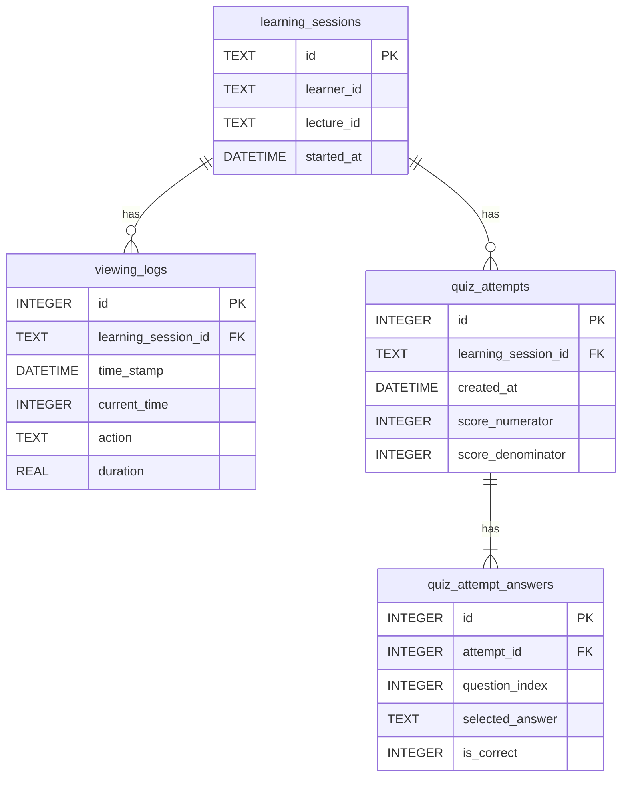

# Framework & Drivers — 学習データ永続化（SQLite）

## 変更理由（Why）

- ドメインでは **視聴ログ・小テストは `LearningSession` 集約の子 Entity** として扱う（[domain-model.md#LearningSession](./domain-model.md)）
- 現行 ADR 初期版は `participant_id` のみで行を束ね、`learning_session_id` / `lecture_id` がなかった
- **学習セッションを中心に、視聴ログと小テストを外部キーで接続する**構成に揃えると、Repository / Mapper・TutorSession 連携・Export が素直になる
- **実験開始前**に本仕様を確定し、以降は ADR どおりスキーマを変更しない

## 関連仕様

- ドメインモデル: [domain-model.md](./domain-model.md)
- Use Case: [application-usecase.md](./application-usecase.md)
- Framework & Drivers 層: [framework-drivers-layer.md](./framework-drivers-layer.md)
- 実装計画 Phase 0: [framework-drivers-implementation-plan.md#phase-0-mapper-設計骨格](./framework-drivers-implementation-plan.md)
- ADR（現行スキーマ）: [ADR_SSSRL-backend_2026-02-23.md §5.2](../../Arcitecture/ADR_SSSRL-backend_2026-02-23.md)
- スキーマ DDL: [db/schema_learning.sql](../../db/schema_learning.sql)、[db/schema.sql](../../db/schema.sql)

---

## 設計方針（What）

| 方針 | 内容 |
|------|------|
| 中心テーブル | **`learning_sessions`** が集約ルートの永続化先 |
| 子テーブル | `viewing_logs`・`quiz_attempts` は **`learning_session_id` FK** で Session に属する |
| 孫テーブル | `quiz_attempt_answers` は **`attempt_id` FK** で `quiz_attempts` に属する（現行と同型） |
| 識別 | Session は **`id`（= `LearningSessionId`）** で Tutoring・Export が参照する |
| 近い実験 | 同一 `(learner_id, lecture_id)` の Session は **1 行まで** |
| 再受験 | 同一 Session に **`quiz_attempts` 複数行**（LAD は最新 1 試行を Read） |
| マイグレーション | **空 DB から新スキーマのみ**。既存データの移行は行わない |
| 小テスト入力 | **`POST /api/quiz-attempts`（Flask）**（API 契約は不変） |

---

## 決定事項

| # | 論点 | 決定 |
|---|------|------|
| 1 | **`learning_sessions.id` の生成** | **UUID 文字列**（`LearningSessionIdGenerator` が INSERT 前に発行） |
| 2 | **子テーブルの `participant_id`** | **廃止**。`learning_session_id` FK に**置き換え**（Session 経由で `learner_id` を参照） |
| 3 | **`ViewingEventId` / `QuizAttemptId`** | DB の **INTEGER `id` を `str()` で文字列化**してドメイン ID とする（INSERT 後の `lastrowid` を Mapper が VO 化） |
| 4 | **マイグレーション** | **空 DB から新スキーマのみ** |
| 5 | **実験開始前のスキーマ確定** | ADR「実験後は変更しない」に従い、**実験開始前に本仕様を確定**する |
| 6 | **小テスト入力** | **`POST /api/quiz-attempts`（Flask）** |
| 7 | **`sessions.learning_session_id` 追加** | **Learning Repository 実装と同時**（Phase 0〜1。Tutoring Phase 3 まで待たない） |

### ID 生成（Mapper / Repository）

| ドメイン ID | 生成タイミング | 実装方針 |
|-------------|----------------|----------|
| `LearningSessionId` | INSERT 前 | UUID 文字列（Port: `LearningSessionIdGenerator`） |
| `ViewingEventId` | INSERT 後 | `viewing_logs.id`（INTEGER AUTOINCREMENT）を文字列化 |
| `QuizAttemptId` | INSERT 後 | `quiz_attempts.id`（INTEGER AUTOINCREMENT）を文字列化 |

`ViewingEventIdGenerator` / `QuizAttemptIdGenerator` は SQLite Adapter では **使用しない**（INSERT → `lastrowid` → `str`）。Use Case の Port 契約は維持し、Fake テストでは従来どおり Generator を差し替え可能とする。

---

## ER（目標像）



---

## テーブル定義

### `learning_sessions`

| 列 | 型 | 制約 | ドメイン対応 |
|----|-----|------|-------------|
| `id` | TEXT | PK | `LearningSessionId`（UUID 文字列） |
| `learner_id` | TEXT | NOT NULL | `LearnerId`（= API `participant_id`） |
| `lecture_id` | TEXT | NOT NULL | `LectureId` |
| `started_at` | DATETIME | NOT NULL | `LearningSession.started_at` |

**制約**

- `UNIQUE (learner_id, lecture_id)` … ドメイン不変条件「同一ペアは Session 1 つ」

### `viewing_logs`

| 列 | 型 | 制約 | ドメイン対応 |
|----|-----|------|-------------|
| `id` | INTEGER | PK AUTOINCREMENT | `ViewingEventId`（`str(id)`） |
| `learning_session_id` | TEXT | NOT NULL, FK → `learning_sessions.id` | 親 Session |
| `time_stamp` | DATETIME | NOT NULL | `ViewingEvent.occurred_at` |
| `current_time` | INTEGER | NOT NULL | `ViewingEvent.video_position` |
| `action` | TEXT | NOT NULL | `ViewingEvent.action` |
| `duration` | REAL | NOT NULL | `ViewingEvent.position_delta` |

**ADR 初期版からの差分**: `participant_id` 列を **`learning_session_id` FK に置き換え**（列は残さない）。

### `quiz_attempts`

| 列 | 型 | 制約 | ドメイン対応 |
|----|-----|------|-------------|
| `id` | INTEGER | PK AUTOINCREMENT | `QuizAttemptId`（`str(id)`） |
| `learning_session_id` | TEXT | NOT NULL, FK → `learning_sessions.id` | 親 Session |
| `created_at` | DATETIME | NOT NULL | `QuizAttempt.attempted_at` |
| `score_numerator` | INTEGER | NOT NULL | 得点分子 |
| `score_denominator` | INTEGER | NOT NULL | 得点分母 |

**再受験**: 同一 `learning_session_id` に複数行 INSERT 可。

**ADR 初期版からの差分**: `participant_id` 列を **`learning_session_id` FK に置き換え**（列は残さない）。

### `quiz_attempt_answers`（現行維持）

| 列 | 型 | 制約 |
|----|-----|------|
| `id` | INTEGER | PK AUTOINCREMENT |
| `attempt_id` | INTEGER | NOT NULL, FK → `quiz_attempts.id` |
| `question_index` | INTEGER | NOT NULL |
| `selected_answer` | TEXT | NOT NULL |
| `is_correct` | INTEGER | NOT NULL, CHECK (0 or 1) |

---

## ドメイン集約 ↔ 行の対応

```
LearningSession (1)
├── viewing_events[]     ← viewing_logs (N)   WHERE learning_session_id = session.id
└── quiz_attempts[]      ← quiz_attempts (N)    WHERE learning_session_id = session.id
         └── answers[]   ← quiz_attempt_answers   WHERE attempt_id = quiz_attempts.id
```

---

## Mapper 契約（What）

### 変更理由（Why）

- Phase 0 の `sqlite_learning_session_mapper` が **行 ↔ `LearningSession` 集約**の入出力を担うため、型・文字列形式・ID 復元規則を本仕様で固定する
- [domain-model.md#ViewingEvent（視聴イベント）](./domain-model.md) の ingress 正規化（小数秒の切り捨て）と **Read 経路の復元**を一致させ、GAS 契約・LAD Read で行内容がブレないようにする

### 対象

`framework_drivers/db/learning/sqlite_learning_session_mapper.py` が変換する **learning.db の全列**（`learning_sessions` / `viewing_logs` / `quiz_attempts` / `quiz_attempt_answers`）。

### 日時列（ISO 8601）

| DB 列 | ドメイン | 保存形式 |
|-------|----------|----------|
| `learning_sessions.started_at` | `LearningSession.started_at` | ISO 8601 文字列 |
| `viewing_logs.time_stamp` | `ViewingEvent.occurred_at` | ISO 8601 文字列 |
| `quiz_attempts.created_at` | `QuizAttempt.attempted_at` | ISO 8601 文字列 |

**契約**

- SQLite の `DATETIME` 列には **ISO 8601 形式の文字列**のみを書き込む（例: `2026-06-21T12:00:00+00:00`）
- Read 時は当該文字列を `datetime` に復元する。タイムゾーン付き文字列は offset 付き `datetime`、オフセット省略時は naive `datetime` として解釈する
- Write 時はドメイン `datetime` の `isoformat()` 相当の文字列を用い、**マイクロ秒は省略してよい**（秒精度で同一時刻とみなす）

### 識別子・テキスト列

| DB 列 | ドメイン | 契約 |
|-------|----------|------|
| `learning_sessions.id` | `LearningSessionId` | UUID 文字列をそのまま TEXT で保存・復元 |
| `learning_sessions.learner_id` | `LearnerId` | 文字列をそのまま保存・復元 |
| `learning_sessions.lecture_id` | `LectureId` | 文字列をそのまま保存・復元 |
| `viewing_logs.id` | `ViewingEventId` | INTEGER PK を **`str(integer_pk)`** で復元（例: `42` → `"42"`）。ゼロ埋め・接頭辞は付けない |
| `quiz_attempts.id` | `QuizAttemptId` | 同上 |
| `viewing_logs.learning_session_id` | 親 `LearningSessionId` | FK 文字列をそのまま保存・復元 |

`ViewingEventId` / `QuizAttemptId` の生成タイミングは [決定事項 #3](#決定事項) および [ID 生成（Mapper / Repository）](#id-生成mapper--repository) に従う。Mapper は INSERT 前の子 ID を **受け付けない**（未永続行は ID なしで Repository が INSERT → `lastrowid` → Mapper が VO 化する）。

### ViewingEvent 列

| DB 列 | 型 | ドメイン | 契約 |
|-------|-----|----------|------|
| `current_time` | INTEGER | `ViewingEvent.video_position` | 非負整数秒。Write 時は `int` をそのまま保存 |
| `action` | TEXT | `ViewingAction` | **`ViewingAction.value` 文字列**のみ保存・復元（下表） |
| `duration` | REAL | `ViewingEvent.position_delta` | 符号付き秒。変換規則は次節 |

**`ViewingAction` 値（保存・復元で許容する文字列）**

| 値 | 列挙 |
|----|------|
| `play` | `ViewingAction.PLAY` |
| `pause` | `ViewingAction.PAUSE` |
| `forward_skip` | `ViewingAction.FORWARD_SKIP` |
| `backward_skip` | `ViewingAction.BACKWARD_SKIP` |
| `forward_seek` | `ViewingAction.FORWARD_SEEK` |
| `backward_seek` | `ViewingAction.BACKWARD_SEEK` |

上記以外の `action` 文字列を Read した場合、Mapper は **変換に失敗**とみなす（集約再構成を中断する）。

### `duration` ↔ `position_delta`（REAL / int）

[domain-model.md](./domain-model.md) および ingress（`application/common/viewing_seconds.py`）と **同一の整数化規則**を Mapper でも適用する。

| 方向 | 規則 |
|------|------|
| Entity → Row（Write） | ドメイン `position_delta`（`int`）を `float` に変換して `duration`（REAL）に保存する。整数値は正確に表現される（例: `-30` → `-30.0`） |
| Row → Entity（Read） | `duration`（REAL）を **0 方向へ切り捨て**て `int` の `position_delta` に復元する（例: `10.9` → `10`、`-10.9` → `-10`） |
| 許容範囲 | Read 後の `position_delta` はドメイン不変条件（`play`/`pause` で 0、skip/seek の符号）を満たす必要がある。満たさない行は Mapper が **変換に失敗**とみなす |

**受入の数値例**

| `duration`（DB） | `position_delta`（Entity） |
|------------------|----------------------------|
| `0.0` | `0` |
| `10.0` | `10` |
| `10.5` | `10` |
| `-30.0` | `-30` |
| `-30.7` | `-30` |

GAS / API が小数 `duration` を送った場合は ingress で先に整数化されるが、DB に REAL 小数が残存していても Read 時は上表どおり切り捨て復元する。

### QuizAttempt / QuizAnswer 列

| DB 列 | ドメイン | 契約 |
|-------|----------|------|
| `score_numerator` | `QuizAttempt.score_numerator` | 非負整数 |
| `score_denominator` | `QuizAttempt.score_denominator` | 正整数 |
| `quiz_attempt_answers.question_index` | `QuizAnswer.question_index` | 非負整数。同一 Attempt 内で一意 |
| `quiz_attempt_answers.selected_answer` | `QuizAnswer.selected_answer` | 文字列をそのまま |
| `quiz_attempt_answers.is_correct` | `QuizAnswer.is_correct` | **`0` → `False` / `1` → `True`**。それ以外は変換失敗 |

`QuizAnswer` にドメイン ID はない。Mapper は `question_index` 昇順で `tuple[QuizAnswer, ...]` を再構成する。

### 集約再構成の順序（Read）

| 子集合 | 並び |
|--------|------|
| `viewing_events` | `time_stamp` 昇順、同値時は `viewing_logs.id` 昇順 |
| `quiz_attempts` | `created_at` 昇順、同値時は `quiz_attempts.id` 昇順 |
| `answers`（各 Attempt 内） | `question_index` 昇順 |

### Mapper 受入基準

- [ ] `viewing_logs` 1 行（`action=play`, `duration=0.0`）が `ViewingEvent` に変換できる
- [ ] `duration=10.5` の行を Read すると `position_delta=10` になる
- [ ] `ViewingEventId("7")` / `QuizAttemptId("3")` が INTEGER PK `7` / `3` から復元できる
- [ ] 日時列が ISO 8601 文字列で往復し、`LearningSession.started_at` / `ViewingEvent.occurred_at` / `QuizAttempt.attempted_at` が一致する
- [ ] 未知の `action` 文字列または `is_correct` が `0`/`1` 以外の行で Mapper が失敗する

---

### Repository 操作（What）

| 操作 | 手順（概要） |
|------|-------------|
| `find_by_learner_and_lecture` | `learning_sessions` を `(learner_id, lecture_id)` で 1 件取得 → 紐づく logs / attempts / answers を読み込み → 集約再構成 |
| `save`（新規 Session） | `learning_sessions` INSERT → 子行 INSERT |
| `save`（追記） | Session メタは UPDATE 不要な場合あり。新規 `viewing_logs` / `quiz_attempts`(+answers) の INSERT のみ |
| `list_by_learner` | `learning_sessions` WHERE `learner_id` |

---

## Write 経路との対応

| API / UC | DB への効き方 |
|----------|---------------|
| `StartOrGetLearningSession` | 無ければ `learning_sessions` に 1 行 INSERT（`id` = UUID） |
| `RecordViewingEvent` | 対象 Session 確保後、`viewing_logs` に 1 行 INSERT → `ViewingEventId = str(lastrowid)` |
| `RecordQuizAttempt` | 対象 Session 確保後、`quiz_attempts` + `quiz_attempt_answers` に INSERT → `QuizAttemptId = str(lastrowid)` |
| `GetLearningSnapshot` | Session + 子を読み、`LearningSnapshotBuilder` へ |

小テスト入力は **`POST /api/quiz-attempts`（Flask）**。payload の `participant_id` は interfaces 層で `learner_id` に変換し、Repository が Session を特定してから INSERT する。

---

## 対話 DB（`tutor.db`）との接続

TutorSession は `learning_session_id` で Learning を参照する（[domain-model.md#TutorSession](./domain-model.md)）。

### `sessions` テーブル

| 列 | 型 | 備考 |
|----|-----|------|
| `id` | TEXT | PK（`TutorSessionId`） |
| `created_at` | DATETIME | |
| `participant_id` | TEXT | 既存（調査・後方互換用に残す） |
| `learning_session_id` | TEXT | **NOT NULL**（空 DB 新規作成時）。FK → `learning.db.learning_sessions.id`（DB 跨ぎ FK は SQLite では参照整合はアプリ側） |

**追加タイミング**: `SqliteLearningSessionRepository` と同じ Phase（Phase 0〜1）で [db/schema.sql](../../db/schema.sql) を更新する。

近い実験: 1 `LearningSession` に `TutorSession` 1 本（`NearTermExperimentPolicy`）。

---

## ADR 初期版スキーマとの差分

| 項目 | ADR 初期版（旧 schema_learning.sql） | 本仕様 |
|------|--------------------------------------|--------|
| `learning_sessions` | なし | **新設** |
| `viewing_logs.participant_id` | あり | **`learning_session_id` FK に置換** |
| `quiz_attempts.participant_id` | あり | **`learning_session_id` FK に置換** |
| `lecture_id` | 列なし | **`learning_sessions.lecture_id`** |
| `quiz_attempt_answers` | 現行どおり | 変更なし |
| `sessions.learning_session_id` | なし | **追加**（tutor.db） |

---

## ADR との関係

- ADR §5.2 は **`participant_id` 直結の 3 テーブル**を記述している
- 本仕様は **ドメイン集約と Tutoring 連携に合わせた拡張**であり、ADR の精神（学習データ 2 DB・Spreadsheet 非参照）は維持する
- **実験開始後**は本スキーマを固定する。変更が必要なら実験条件の見直しとして扱う（ADR 準拠）

---

## 受入基準（本仕様）

- [x] `learning_sessions` を中心とした ER が記載されている
- [x] 視聴ログ・小テストが `learning_session_id` FK で Session に属することが定義されている
- [x] ドメイン集約との 1:1 対応が表で示されている
- [x] ADR 初期版スキーマとの差分が明示されている
- [x] 決定事項 #1〜#7 が記載されている
- [x] Tutor `sessions.learning_session_id` 接続が記載されている
- [x] [db/schema_learning.sql](../../db/schema_learning.sql) が本仕様を反映している
- [x] [Mapper 契約（What）](#mapper-契約what) が記載されている（日時 ISO 8601、`action` 値、`duration` ↔ `position_delta`、子 Entity ID 復元）
