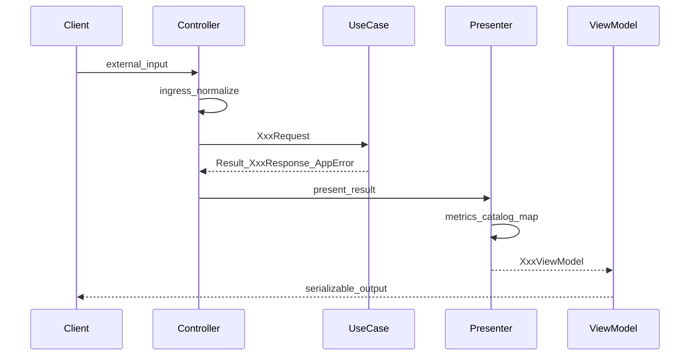
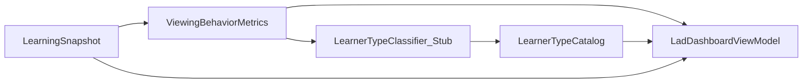

# interfaces 層（Interface Adapters）実装計画

## 変更理由（Why）

- [application-usecase.md](./application-usecase.md) で Use Case / Port / DTO は定義済み。次は **外側との変換**（ingress / egress）を `app/main.py` から切り出し、Controller → UC → Presenter → ViewModel の流れを確立する
- LAD は生ログ返却ではなく、**操作集計・動画2分区間集計・小テスト（問題文付き）・学習者プロファイル**を返す新契約に置き換える（破壊的変更・合意済み）
- 学習者タイプ分類ルールは未確定のため、**Classifier は Port + Stub** とし、設計と Metrics / Catalog / Presenter を先に固める

## スコープ

### 本計画に含める

| 要素 | 説明 |
|------|------|
| 仕様 | [interfaces-layer.md](./interfaces-layer.md)（What: ViewModel 契約・責務分界） |
| パッケージ | `interfaces/`（Flask / sqlite3 / vertexai を import しない） |
| 共通 | ingress 正規化、`AppError` → エラー ViewModel 変換 |
| Learning Read | `GetLearningSnapshot` 用 Controller / Presenter / ViewModel |
| LAD 加工 | `ViewingBehaviorMetrics`、2分バケット（`video_position // 120`）、`LearnerTypeCatalog`（静的）、`LearnerTypeClassifier`（Stub） |
| Learning Write | `RecordViewingEvent` / `RecordQuizAttempt` 用 Controller / Presenter |
| Tutoring ACL | `ChatPromptBuilder` 具象（`app/main.py` の `_format_*` 移行先） |
| Tutoring | `SendChatMessage` 用 Controller / Presenter |
| テスト | `tests/test_interfaces/`（UC Fake 注入・DB 不要） |

### 本計画に含めない（別フェーズ）

- Infrastructure Adapter（`db/` Mapper、Repository 実装の UC 接続）
- Flask ルート配線（`app/main.py` 置換）
- `LearnerTypeClassifier` の本番ルール実装
- Research Export の interfaces 層
- DB スキーマ変更

## 前提・依存

- ドメイン: [domain-model.md](./domain-model.md)
- アプリケーション: [application-usecase.md](./application-usecase.md)、[application-error-handling.md](./application-error-handling.md)
- interfaces 層仕様: [interfaces-layer.md](./interfaces-layer.md)
- 既存 UC 実装: `application/learning/use_cases/get_learning_snapshot.py` ほか `application/learning/`・`application/tutoring/`
- **命名注意**: `application/learning/adapters/` は Application 層内部 Adapter。本計画の `interfaces/` とは別物
- テスト: `uv run pytest tests/ -v`
- Python 3.10+

## データフロー（目標像）



LAD（`GetLearningSnapshot`）の Presenter 内部:



## 目標ディレクトリ構成

```
interfaces/
  __init__.py
  common/
    ingress.py              # participant_id → LearnerId, viewing_seconds 委譲
    error_presenter.py      # AppError → ErrorViewModel
    default_lecture.py      # 近い実験用 lecture_id 解決（設定 / 定数）
  learning/
    controllers/
      get_learning_snapshot_controller.py
      record_viewing_event_controller.py
      record_quiz_attempt_controller.py
    presenters/
      lad_dashboard_presenter.py
      record_viewing_event_presenter.py
      record_quiz_attempt_presenter.py
      last_updated_presenter.py
    view_models/
      lad_dashboard.py
      last_updated.py
      record_responses.py
      errors.py
    services/
      viewing_behavior_metrics.py   # 操作カウント・2分バケット
      quiz_result_rows.py           # quizDefinition 結合
    ports/
      learner_type_classifier.py    # Protocol
      learner_type_catalog.py       # Protocol
    catalog/
      learner_type_catalog.py       # 4タイプ静的文（研究テキスト）
    classifiers/
      stub_learner_type_classifier.py
  tutoring/
    controllers/
      send_chat_message_controller.py
    presenters/
      chat_response_presenter.py
    view_models/
      chat_response.py
    chat_prompt_builder.py          # ChatPromptBuilder 具象（SRT 含む）
tests/
  test_interfaces/
    test_learning/
    test_tutoring/
    fakes/
```

## 層の責務分界

| 層 | 責務 | import 禁止例 |
|----|------|---------------|
| Controller | 外部入力 → Request DTO、UC 呼び出し、Presenter 委譲 | レスポンス JSON 詳細の組み立て |
| Presenter | `Result` / Response → ViewModel、集計・結合・静的 Catalog 参照 | `repository.save`、ビジネスオーケストレーション |
| ViewModel | クライアント契約の型（フレームワーク非依存） | UC / Entity の露出 |
| LearnerTypeClassifier | metrics → `type_code \| None` | 研究テキストの保持 |
| LearnerTypeCatalog | `type_code` → 特徴・動機づけ・成績（静的） | 視聴ログの解析 |

## LAD ViewModel 契約（概要）

[破壊的変更] 既存 `viewing_logs` / `latest_quiz_attempt` / `quiz_answers` の生 dict は返さない。詳細は [interfaces-layer.md#LAD 表示要件と ViewModel 契約](./interfaces-layer.md#lad-表示要件と-viewmodel-契約)。

| フィールド | 内容 | 算出元 |
|-----------|------|--------|
| `action_counts` | 操作種類別カウント | `viewing_events` |
| `video_segments` | 動画120秒区間ごとの `action_counts`（`video_position // 120`） | `viewing_events` |
| `quiz_results` | 問題文・選択回答・正誤 | `quiz_answers` + `Lecture.quizDefinition` |
| `score` | 得点 | `latest_quiz_attempt` |
| `learner_profile` | タイプ名・**動的** `learning_behaviors`・**静的** 特徴/動機づけ/成績 | Classifier + Catalog |
| `content_updated_at` | 最終更新 | `GetLearningSnapshotResponse` |

Session 未作成（空 Snapshot）→ HTTP 200 相当の成功 ViewModel（空集計・プロファイルなしまたは行動のみ）。`LectureNotFoundError` → エラー ViewModel。

## ingress 方針

| 外部 | 内部 | 備考 |
|------|------|------|
| `participant_id` | `LearnerId` | 空文字は Controller で拒否可 |
| `lecture_id`（未送信時） | `LectureId` | `interfaces/common/default_lecture.py` で近い実験の固定講義を解決 |
| `current_time` / `duration` | `video_position` / `position_delta` | `application/common/viewing_seconds.py` に委譲 |

## フェーズ分割（1 フェーズ ≒ 1 PR）

### Phase 0: 仕様ドキュメント

**What**

- [interfaces-layer.md](./interfaces-layer.md) を新規作成（ViewModel 契約・Controller/Presenter 規約・LAD 表示要件・2分バケット定義・学習者タイプの静的/動的の分離）
- [docs/README.md](../README.md) に仕様リンク追加
- 本計画を `interfaces-implementation-plan.md` として保存

**受入基準**

- LAD 4表示ブロックと ViewModel フィールドが 1:1 で対応している
- Classifier ルールは「TBD・Stub」と明記されている

---

### Phase 1: パッケージ骨格と共通部品

**What**

- `interfaces/` パッケージ作成
- `ErrorViewModel` + `AppError` → HTTP ステータス相当の `status_kind` マッピング（[application-error-handling.md#エラーステータス一覧](./application-error-handling.md#エラーステータス一覧) 準拠）
- `ingress.py`（`LearnerId` / `LectureId` 変換、`viewing_seconds` ラップ）
- `default_lecture.py`（環境変数または定数で `LectureId` 解決）
- `tests/test_interfaces/test_common/`

**受入基準**

- `interfaces/` から `flask` / `sqlite3` / `vertexai` を import しない
- `LECTURE_NOT_FOUND` 等の代表エラーが `ErrorViewModel` に変換できる

---

### Phase 2: GetLearningSnapshot LAD 縦切り（コア）

**What**

- `ViewingBehaviorMetrics`（全体 `action_counts` + `video_segments`）
  - バケット: `segment_start_sec = (video_position // 120) * 120`
  - 各イベントは発生時点の `video_position` で 1 バケットに割当
- `LearnerTypeCatalog`（Advanced / Diligent / Indifferent / Persistent の静的文）
- `LearnerTypeClassifier` Protocol + `StubLearnerTypeClassifier`（常に `None` またはテスト用固定値）
- `LadDashboardPresenter`（`Result[GetLearningSnapshotResponse, AppError]` + `Lecture` → `LadDashboardViewModel`）
- `GetLearningSnapshotController`（外部入力 → UC → Presenter）
- `tests/test_interfaces/test_learning/test_lad_dashboard_presenter.py` 等（`tests/test_application/test_learning/test_get_learning_snapshot.py` の Fake を再利用）

**受入基準**

- 代表 `viewing_events` で `action_counts` と 2分バケットが期待どおり
- `quiz_results` に問題文が含まれる（`question_index` 結合）
- 空 Snapshot → 成功 ViewModel（404 相当にしない）
- `StubLearnerTypeClassifier` 使用時、`type_code=None` でも `learning_behaviors` は数値付きで生成される
- `type_code` 指定時、Catalog の静的文が `learner_profile` に載る

---

### Phase 3: LastUpdated 薄い Adapter

**What**

- `LastUpdatedViewModel` + `LastUpdatedPresenter`（`content_updated_at` のみ抽出）
- 同一 `GetLearningSnapshotController` を再利用する薄いラッパ、または専用 Controller

**受入基準**

- Session 未作成 → `last_updated: null`
- イベントあり → 最大 `occurred_at` / `attempted_at` が返る

---

### Phase 4: Learning Write Controllers

**What**

- `RecordViewingEventController` + Presenter（成功 ACK ViewModel / エラー ViewModel）
- `RecordQuizAttemptController` + Presenter
- ingress: 既存 GAS 契約（`tests/test_api/test_viewing_log_gas_contract.py`）に合わせたフィールド名変換

**受入基準**

- Fake UC 注入で Controller 単体テストが通る
- `current_time` / `duration` の小数切り捨てが ingress で適用される

---

### Phase 5: Tutoring ACL（ChatPromptBuilder）

**What**

- `application/tutoring/ports/chat_prompt_builder.py` の具象を `interfaces/tutoring/chat_prompt_builder.py` に実装
- `app/main.py` の `_format_lecture_log` / `_format_quiz_result` / `_build_lecture_transcript` ロジックを移行（SRT は `app/srt.py` を interfaces から参照可、または common へ移動を別 PR で検討）
- `tests/test_interfaces/test_tutoring/test_chat_prompt_builder.py`（既存 `tests/test_chat_lad/` の期待に近い振る舞い）

**受入基準**

- `LearningSnapshot` + `Lecture` からプロンプト断片が生成される
- Tutoring が Learning Entity を直接 import しない（Snapshot + Lecture のみ）

---

### Phase 6: SendChatMessage Controller

**What**

- `SendChatMessageController` + `ChatResponsePresenter`
- 初回半角数字定型文など HTTP 契約は Presenter / Controller 層で表現（UC テストは既存を維持）

**受入基準**

- Fake `SendChatMessageUseCase` で `ChatResponseViewModel` が生成される
- エラー系（`TUTOR_SESSION_NOT_FOUND` 等）が `ErrorViewModel` に変換される

---

### Phase 7: Flask 接続（Infrastructure 完了後）

**前提**: Phase 6 まで完了 + Application Infrastructure Adapter（`db/` Mapper 等）が UC を駆動できる状態

**What**

- `app/main.py` ルートを Controller 呼び出しに置換
- ViewModel → `jsonify`（唯一の Flask 依存点）
- `tests/test_api/test_lad_api.py` を **新 LAD 契約**に更新（破壊的変更）
- 既存 API 統合テスト GREEN 維持

**受入基準**

- `uv run pytest tests/ -v` 全パス
- `GET /api/participants/{id}/lad` が新 ViewModel 形状を返す

---

### Phase 8（後続・本計画外）: 学習者タイプ判定ルール

- `RuleBasedLearnerTypeClassifier` 実装
- 閾値仕様を [interfaces-layer.md](./interfaces-layer.md) に追記
- 代表パターンのイベント列 → 期待 `type_code` テスト

## テスト戦略

| 対象 | 方針 |
|------|------|
| Presenter / Metrics | 純関数・Fake UC / 手作り `LearningSnapshot` |
| Controller | Use Case / Presenter を Fake 注入 |
| Catalog | 4タイプの lookup スモーク |
| Classifier | Phase 2 は Stub のみ。Phase 8 でルールテスト追加 |
| Flask / DB | Phase 7 まで interfaces 単体テストに閉じる |

## リスクと対処

| リスク | 対処 |
|--------|------|
| LAD フロントが旧 JSON 前提 | 破壊的変更を仕様に明記。Phase 7 で同時更新 |
| `lecture_id` 未導入 API | `default_lecture` で近い実験をカバー。将来クエリ param へ拡張 |
| `application/learning/adapters` との混同 | ディレクトリ名 `interfaces/`、仕様で役割を区別 |
| SRT 依存 | Phase 5 で `app/srt.py` 参照。必要なら `interfaces/common/srt` へ後続移動 |

## 完了の受入基準（interfaces 層・Flask 接続前）

- [ ] [interfaces-layer.md](./interfaces-layer.md) が存在し、LAD ViewModel と責務分界が記載されている
- [ ] Controller → UC → Presenter → ViewModel の Learning Read 縦切りがテストで検証されている
- [ ] LAD 4表示要素（集計×2・クイズ表・プロファイル）が ViewModel に表現されている
- [ ] Classifier は Stub、Catalog は静的文を返す
- [ ] `interfaces/` に Flask / SQLite / vertexai の import がない
- [ ] `tests/test_interfaces/` が `uv run pytest` でパス
