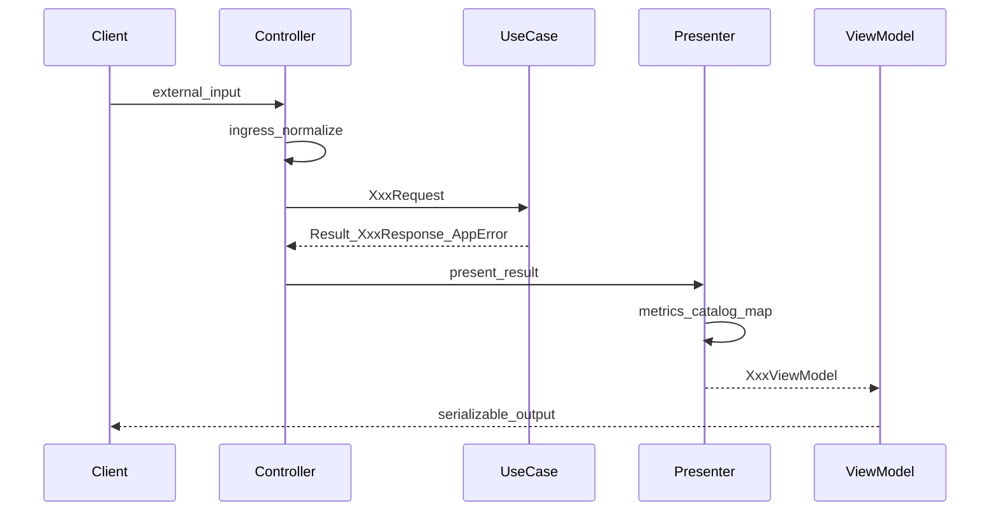
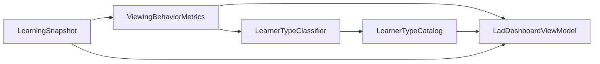

# interfaces 層（Interface Adapters）

## 変更理由（Why）

- [application-usecase.md](./application-usecase.md) で Use Case / Port / DTO は定義済み。次は **外側との変換**（ingress / egress）を `app/main.py` から切り出し、Controller → Use Case → Presenter → ViewModel の流れを確立する
- LAD は生ログ返却ではなく、**操作集計・動画 2 分区間集計・小テスト（問題文付き）・学習者プロファイル**を返す新契約に置き換える（破壊的変更・合意済み）
- LAD 学習者タイプ判定は **ViewingBehaviorMetrics の派生指標**と **RuleBasedLearnerTypeClassifier** で確定する。動画総尺は **VideoDurationResolver** Port（Infrastructure 実装）で解決する
- 近い実験は **3 講義 × 1 学習者**（`participant_id` 1/2/3 で `lecture-1/2/3` を自動解決）。`lecture_id` 未送信 API の ingress 規約を本仕様で確定する

## スコープ

### 本仕様に含める

| 要素 | 説明 |
|------|------|
| 責務分界 | Controller / Presenter / ViewModel / Classifier / Catalog の役割 |
| ViewModel 契約 | LAD・LastUpdated・Write ACK・Chat・Error のクライアント向け型 |
| ingress 規約 | 外部フィールド名 → Application DTO への正規化 |
| LAD 表示要件 | 4 表示ブロックと ViewModel フィールドの 1:1 対応 |
| 2 分バケット定義 | 動画区間集計の割当ルール |
| 学習者タイプ | 静的文（Catalog）と動的指標（`learning_behaviors`）の分離。**RuleBasedLearnerTypeClassifier** ルールと **VideoDurationResolver** Port |

### 本仕様に含めない（別仕様・別 PR）

- Use Case の手順・Port 契約（[application-usecase.md](./application-usecase.md)）
- `AppError` / `Result` の定義（[application-error-handling.md](./application-error-handling.md)）
- Port の Infrastructure 実装（`db/` Mapper、Repository）
- Flask ルート配線・`jsonify`（Phase 7。Infrastructure 完了後）
- `VideoDurationResolver` の Infrastructure 実装詳細（YouTube API・キャッシュ。Port 契約は本仕様）
- Research Export の interfaces 層
- DB スキーマ変更

## 関連仕様

- ドメインモデル: [domain-model.md](./domain-model.md)
- アプリケーション層ユースケース: [application-usecase.md](./application-usecase.md)
- アプリケーション層エラー処理: [application-error-handling.md](./application-error-handling.md)
- 段階的実装計画: [interfaces-implementation-plan.md](./interfaces-implementation-plan.md)

### `application/learning/adapters` との区別

| パス | 層 | 役割 |
|------|-----|------|
| `application/learning/adapters/` | Application 層内部 | Port 実装・ACL（例: `GetLearningSnapshotQuery`） |
| `interfaces/` | interfaces 層 | HTTP / GAS 等の外部契約 ↔ Use Case DTO / ViewModel |

本仕様の `interfaces/` はクリーンアーキテクチャの **Interface Adapters** を指す。Application 層の `adapters` パッケージとは別物である。

---

## データフロー



LAD（`GetLearningSnapshot`）の Presenter 内部:



**Flask 接続後（Phase 7）** のみ、`app/main.py` が ViewModel を `jsonify` する。それ以外の `interfaces/` コードは Flask を import しない。

---

## 目標ディレクトリ構成

```
interfaces/
  __init__.py
  common/
    ingress.py
    error_presenter.py
    default_lecture.py
    learner_lecture_mapping.py
  learning/
    controllers/
    presenters/
    view_models/
    services/
    ports/
      learner_type_classifier.py
      video_duration_resolver.py
    catalog/
    classifiers/
      stub_learner_type_classifier.py
      rule_based_learner_type_classifier.py
  tutoring/
    controllers/
    presenters/
    view_models/
    chat_prompt_builder.py
tests/
  test_interfaces/
```

---

## 層の責務分界

| コンポーネント | 責務 | 行わないこと |
|---------------|------|-------------|
| Controller | 外部入力の正規化、Request DTO 組み立て、Use Case 呼び出し、Presenter への委譲 | レスポンス JSON の詳細組み立て、`repository.save` |
| Presenter | `Result` / Response → ViewModel、集計・結合・静的 Catalog 参照 | ビジネスオーケストレーション、永続化 |
| ViewModel | クライアント契約の型（フレームワーク非依存・シリアライズ可能） | Use Case / Entity の直接露出 |
| `ViewingBehaviorMetrics` | `viewing_events` と動画総尺から操作カウント・2 分バケット・派生指標を集計 | 学習者タイプ判定（Classifier へ委譲） |
| `LearnerTypeClassifier` | 集計結果 → `type_code \| None`（RuleBased は常に 4 いずれか） | 研究テキストの保持 |
| `VideoDurationResolver` | `Lecture`（主に `video_url`）→ 動画総尺（秒） | Use Case オーケストレーション |
| `LearnerTypeCatalog` | `type_code` → 特徴・動機づけ・成績（静的文） | 視聴ログの解析 |

### import 禁止

`interfaces/` パッケージから **`flask` / `sqlite3` / `vertexai` を import しない**。

---

## Controller 規約

| 項目 | 規約 |
|------|------|
| クラス名 | `{UseCaseId}Controller`（例: `GetLearningSnapshotController`） |
| 依存 | コンストラクタ注入（対応 Use Case、Presenter、ingress ヘルパ） |
| 入口 | 外部入力（dict / プリミティブ）を受け、ViewModel またはエラー ViewModel を返す |
| 検証 | 空 `participant_id` 等の ingress 段階の拒否は Controller で行ってよい |
| `lecture_id` 未送信 | [default_lecture](#default_lecture) で `participant_id` から `LectureId` を解決する |

---

## Presenter 規約

| 項目 | 規約 |
|------|------|
| クラス名 | `{画面または用途}Presenter`（例: `LadDashboardPresenter`） |
| 入力 | `Result[Response, AppError]` および Presenter 固有の補助入力（例: `Lecture`） |
| 成功 | 対応 ViewModel を返す |
| 失敗 | `ErrorPresenter` に委譲するか、呼び出し元 Controller が `ErrorPresenter` を使う |
| Entity 露出 | ViewModel は Entity をそのまま載せない。必要なフィールドのみ変換する |

---

## ingress 規約

外部（HTTP / GAS）フィールド名を Application 層 DTO へ変換する。変換は **interfaces 層** が担う（[application-usecase.md#DTO](./application-usecase.md#dto)）。

| 外部 | 内部 | 備考 |
|------|------|------|
| `participant_id` | `LearnerId` | 空文字は Controller で拒否可 |
| `lecture_id`（未送信時） | `LectureId` | [default_lecture](#default_lecture) で `participant_id` から講義を解決 |
| `time_stamp` | `occurred_at` | 視聴ログ |
| `current_time` | `video_position` | `application.common.viewing_seconds` で整数秒へ（小数切り捨て） |
| `duration` | `position_delta` | 同上 |
| `action` | `ViewingAction` | 列挙値文字列 |
| `message` | `user_message` | チャット |
| `session_id` | `tutor_session_id` | チャット継続時 |

`current_time` / `duration` の `NaN` / `Infinity` / 非数値文字列は `ValidationError` 相当としてエラー ViewModel に変換する（[application-error-handling.md](./application-error-handling.md)）。

---

## default_lecture

近い実験ではクライアントが `lecture_id` を送信しないため、interfaces 層が **`participant_id` から `LectureId` を自動解決**する。1 参加者 1 講義 1 `LearningSession`（`UNIQUE (learner_id, lecture_id)` は既存のまま）。URL に `lecture_id` は不要。

### 解決優先順位

| 優先 | 条件 | 結果 |
|------|------|------|
| 1 | クエリ / JSON body に **`lecture_id` が明示**されている | `parse_lecture_id` で検証（マップ・default は使用しない） |
| 2 | `participant_id` が近い実験マップに命中 | 対応する `LectureId` |
| 3 | 上記以外 | `resolve_default_lecture_id()` → **`lecture-1`**（後方互換） |

### 近い実験: participant_id → lecture_id 固定マップ

| participant_id | lecture_id | YouTube 動画 ID（参考） |
|----------------|------------|------------------------|
| `1` | `lecture-1` | `Y2HC0I8cTAI` |
| `2` | `lecture-2` | `1MuwwFipX9o` |
| `3` | `lecture-3` | `Sa06YB2oXyw` |

マップ外の `participant_id`（単体テスト用 `learner-1` 等）は **優先 3** により **`lecture-1` にフォールバック**する。既存テストは原則そのまま通過する。

### 実装配置

| 項目 | 規約 |
|------|------|
| マップ定数 | `interfaces/common/learner_lecture_mapping.py` — `NEAR_TERM_PARTICIPANT_LECTURE_MAP` |
| 解決関数 | `resolve_lecture_id_for_participant(participant_id, lecture_id=None)` |
| ingress ラッパ | `interfaces/common/ingress.py` — `parse_lecture_id_for_participant(...)` |
| フォールバック | `interfaces/common/default_lecture.py` — `resolve_default_lecture_id()`（既定 `lecture-1`。環境変数 `DEFAULT_LECTURE_ID` で上書き可） |

### 利用箇所

`GetLearningSnapshot` / `GetLastUpdated` / Write Controller（`RecordViewingEvent` / `RecordQuizAttempt`）/ `SendChatMessage` の ingress。`lecture_id` 未送信時は上記解決順を適用する。

---

## ErrorViewModel

`AppError` をクライアント向けエラー表現へ変換する。HTTP ステータスは Flask 接続層が `status_kind` から決定する。

| フィールド | 説明 |
|-----------|------|
| `error_code` | `ErrorCode` 文字列（機械可読） |
| `message` | 人間可読メッセージ（任意） |
| `status_kind` | `not_found` / `conflict` / `validation` / `gateway` 等。 [application-error-handling.md#エラーステータス一覧](./application-error-handling.md#エラーステータス一覧) に準拠 |

### 代表マッピング

| AppError | ErrorCode | status_kind |
|----------|-----------|-------------|
| `LectureNotFoundError` | `LECTURE_NOT_FOUND` | `not_found` |
| `TutorSessionNotFoundError` | `TUTOR_SESSION_NOT_FOUND` | `not_found` |
| `ConflictError` | `DUPLICATE_LEARNING_SESSION` 等 | `conflict` |
| `ValidationError` | 各種 | `validation` |
| `LlmGatewayError` | `LLM_GATEWAY_ERROR` | `gateway` |
| `ValidationError`（尺 `<= 0` / video ID 解決不可） | `VALIDATION_ERROR` 等 | `validation` |
| `VideoMetadataGatewayError` | `VIDEO_METADATA_GATEWAY_ERROR` | `gateway` |

---

## LAD 表示要件と ViewModel 契約

### 破壊的変更

既存 `GET /api/participants/{id}/lad` が返す **`viewing_logs` / `latest_quiz_attempt` / `quiz_answers` の生 dict は返さない**。Presenter が加工した ViewModel のみを返す。

### LAD 4 表示ブロック ↔ ViewModel 1:1 対応

| # | LAD UI 表示ブロック | ViewModel フィールド | 内容 |
|---|-------------------|---------------------|------|
| 1 | 操作種類別集計（全体） | `action_counts` | `ViewingAction` ごとの件数 |
| 2 | 動画 2 分区間ごとの操作集計 | `video_segments` | 120 秒区間ごとの `action_counts` |
| 3 | 小テスト結果表 | `quiz_results`, `score` | 問題文・選択回答・正誤、最新試行の得点 |
| 4 | 学習者プロファイル | `learner_profile` | タイプ名、動的 `learning_behaviors`、静的 特徴/動機づけ/成績 |

加えて、画面の更新判定用に `content_updated_at` を載せる（[GetLearningSnapshotResponse](./application-usecase.md#getlearningsnapshot) 由来）。

### `LadDashboardViewModel`

| フィールド | 型 | 説明 | 算出元 |
|-----------|-----|------|--------|
| `action_counts` | `dict[str, int]` | 操作種類別カウント。キーは `ViewingAction` の値（`play`, `pause` 等） | `snapshot.viewing_events` |
| `video_segments` | `list[VideoSegmentViewModel]` | 動画 120 秒区間ごとの集計 | `snapshot.viewing_events` |
| `quiz_results` | `list[QuizResultRowViewModel]` | 問題文付きの回答行 | `snapshot.quiz_answers` + `Lecture.quiz_definition` |
| `score` | `int \| None` | 最新試行の得点。未受験時 `None` | `snapshot.latest_quiz_attempt` |
| `learner_profile` | `LearnerProfileViewModel \| None` | 学習者プロファイル。下記「空 Snapshot」参照 | Classifier + Catalog + Metrics |
| `content_updated_at` | `datetime \| None` | 最終更新時刻 | `GetLearningSnapshotResponse.content_updated_at` |

#### `VideoSegmentViewModel`

| フィールド | 型 | 説明 |
|-----------|-----|------|
| `segment_start_sec` | `int` | 区間開始秒（120 の倍数） |
| `action_counts` | `dict[str, int]` | 当該区間内の操作種類別カウント |

#### `QuizResultRowViewModel`

| フィールド | 型 | 説明 |
|-----------|-----|------|
| `question_index` | `int` | 設問インデックス（0 始まり） |
| `question_text` | `str` | 問題文（`Lecture.quiz_definition` から結合） |
| `selected_choice` | `str` | 学習者が選択した回答 |
| `is_correct` | `bool` | 正誤 |

#### `LearnerProfileViewModel`

| フィールド | 型 | 由来 | 説明 |
|-----------|-----|------|------|
| `type_code` | `str \| None` | Classifier | `advanced` / `diligent` / `indifferent` / `persistent`。RuleBased 使用時は常に 4 いずれか。Stub 使用時は `None` |
| `type_name` | `str \| None` | Catalog | 表示用タイプ名。`type_code` が `None` なら `None` |
| `learning_behaviors` | `list[LearningBehaviorViewModel]` | **動的**（Metrics） | 視聴行動の数値付き指標（操作回数等） |
| `characteristics` | `str \| None` | **静的**（Catalog） | タイプの特徴文 |
| `motivation` | `str \| None` | **静的**（Catalog） | 動機づけに関する文 |
| `performance` | `str \| None` | **静的**（Catalog） | 成績傾向に関する文 |

#### `LearningBehaviorViewModel`

| フィールド | 型 | 説明 |
|-----------|-----|------|
| `label` | `str` | 指標の表示名（例: 「再生回数」） |
| `value` | `int` | 集計値 |

### 空 Snapshot（Session 未作成）

Application 層は空 `LearningSnapshot` を **正常系**として返す（HTTP 200 相当）。interfaces 層は **404 にしない**。

| フィールド | 空 Snapshot 時の値 |
|-----------|-------------------|
| `action_counts` | 全操作 0 または空 dict（実装で統一） |
| `video_segments` | 空リスト |
| `quiz_results` | 空リスト |
| `score` | `None` |
| `learner_profile` | `learning_behaviors` のみ（数値付き）を載せ、`type_code` / 静的文は `None` |
| `content_updated_at` | `None` |

### `LectureNotFoundError`

`GetLearningSnapshot` が `err(LectureNotFoundError)` を返した場合、成功 ViewModel ではなく **ErrorViewModel**（`LECTURE_NOT_FOUND` / `not_found`）とする。

---

## `ViewingBehaviorMetrics`

`viewing_events` から LAD 表示用の集計と学習者タイプ判定用の派生指標を生成する。配置: `interfaces/learning/services/viewing_behavior_metrics.py`。

### 生成

| 項目 | 規約 |
|------|------|
| ファクトリ | `ViewingBehaviorMetrics.from_events(events, *, video_duration_sec: int)` |
| 必須引数 | `video_duration_sec` — 動画総尺（秒）。`<= 0` の場合は `ValueError`（Controller 前段の `VideoDurationResolver` でも弾く二重防御） |
| 入力イベント | `LearningSnapshot.viewing_events`（または同等の `ViewingEvent` 列） |

### フィールド（既存）

| フィールド | 説明 |
|-----------|------|
| `action_counts` | 操作種類別件数（全体） |
| `video_segments` | 120 秒区間ごとの `action_counts` |

### フィールド（派生指標・Classifier 入力）

| フィールド | 定義 |
|-----------|------|
| `video_duration_sec` | 動画総尺（秒）。`<= 0` は生成不可 |
| `back_cumulative_sec` | `backward_skip` / `backward_seek` の `abs(position_delta)` 合計 |
| `back_cumulative_time_ratio` | `back_cumulative_sec / video_duration_sec` |
| `forward_ops_per_10min` | `(forward_skip + forward_seek) * 600 / video_duration_sec` |
| `back_ops_per_10min` | `(backward_skip + backward_seek) * 600 / video_duration_sec` |
| `pause_ops_per_10min` | `pause * 600 / video_duration_sec` |

短い動画でも 10 分換算する（例: 300 秒動画・`pause` 3 回 → `pause_ops_per_10min == 6`）。

`position_delta == 0` の `backward_skip` / `backward_seek` は **操作回数に数える**が、累積秒数には **0 を加算**する。

### 2 分バケット定義

動画区間集計は **発生時点の `video_position`** で 1 バケットに割り当てる。

| 項目 | 定義 |
|------|------|
| バケット幅 | 120 秒 |
| 区間開始秒 | `segment_start_sec = (video_position // 120) * 120` |
| 割当 | 各 `ViewingEvent` は、そのイベントの `video_position` に基づき **ちょうど 1 バケット**に計上する |
| 全体集計 | バケットに関係なく、全イベントを `action_counts` に集計する |

**例**: `video_position = 125` → `segment_start_sec = 120`。`video_position = 0` → `segment_start_sec = 0`。

操作種類は [domain-model.md#ViewingAction](./domain-model.md) の列挙値（`play`, `pause`, `forward_skip`, `backward_skip`, `forward_seek`, `backward_seek`）を用いる。

---

## 学習者タイプ（Classifier / Catalog）

### Classifier

| 項目 | 規約 |
|------|------|
| インターフェース | `LearnerTypeClassifier`（Protocol） |
| 入力 | `ViewingBehaviorMetrics` |
| 出力 | `type_code: str \| None`（Protocol 上。本番 `RuleBasedLearnerTypeClassifier` は常に 4 いずれかを返し `None` を返さない） |
| 本番実装 | `RuleBasedLearnerTypeClassifier`（`interfaces/learning/classifiers/rule_based_learner_type_classifier.py`） |
| テスト用 | `StubLearnerTypeClassifier`（常に `None`、またはテスト用固定値） |

Classifier は研究テキストを保持しない。判定ロジックのみを担う。

#### 判定ルール（優先順・排他）

`RuleBasedLearnerTypeClassifier` は次の順で **最初に一致した 1 タイプ**を返す。

| 優先 | type_code | 条件 |
|------|-----------|------|
| 1 | `indifferent` | `back_cumulative_time_ratio >= 0.18` |
| 2 | `advanced` | `forward_ops_per_10min >= 6` **かつ** `back_ops_per_10min >= 3` **かつ** `back_cumulative_time_ratio < 0.18` |
| 3 | `diligent` | 1・2 に該当せず **かつ** `pause_ops_per_10min >= 6` |
| 4 | `persistent` | 上記以外（空イベント含む） |

閾値（`0.18`, `6`, `3`）は Classifier 実装内の定数とする。

### Catalog（静的文）

`LearnerTypeCatalog` は `type_code` から **研究用の固定テキスト**を返す。視聴ログは参照しない。

| type_code | 表示名（type_name） |
|-----------|-------------------|
| `advanced` | Advanced |
| `diligent` | Diligent |
| `indifferent` | Indifferent |
| `persistent` | Persistent |

各タイプについて `characteristics` / `motivation` / `performance` の 3 文を保持する（文言は実装時に研究テキストを Catalog へ配置）。

### 静的と動的の分離

| 区分 | 担当 | ViewModel フィールド |
|------|------|---------------------|
| 動的 | Metrics + Presenter | `learning_behaviors`（操作回数等の実測値） |
| 静的 | Catalog | `type_name`, `characteristics`, `motivation`, `performance` |
| 判定 | Classifier | `type_code` |

`StubLearnerTypeClassifier` 使用時（`type_code=None`）でも **`learning_behaviors` は数値付きで生成される**。`type_code` が指定された場合のみ Catalog の静的文が `learner_profile` に載る。

---

## VideoDurationResolver

LAD 学習者タイプ判定に必要な **動画総尺（秒）** を `Lecture` から解決する Port。Application 層は本 Port を **知らない**（Controller → Presenter 配線のみ）。

| 項目 | 規約 |
|------|------|
| Port | `interfaces/learning/ports/video_duration_resolver.py` |
| メソッド | `resolve(self, lecture: Lecture) -> Result[int, AppError]` |
| 入力 | `Lecture`（主に `video_url`） |
| 成功時 | `duration_sec > 0` を返す |
| 失敗時 | `ValidationError` — 尺 `<= 0`、または `video_url` から video ID を解決できない |
| 失敗時 | `VideoMetadataGatewayError` — 外部 API 障害かつキャッシュ hit なし（[application-error-handling.md](./application-error-handling.md)） |
| Infrastructure 実装 | YouTube Data API Adapter（Pattern B・キャッシュ）。詳細は infrastructure 実装 PR |

### GetLearningSnapshotController での利用

| 手順 | 処理 |
|------|------|
| 1 | Use Case 成功後、`lecture` を取得済み |
| 2 | `duration_result = video_duration_resolver.resolve(lecture)` |
| 3 | `Err` の場合 | `ErrorPresenter` で ErrorViewModel を返す |
| 4 | `Ok(duration_sec)` の場合 | `LadDashboardPresenter.present(..., video_duration_sec=duration_sec)` |

### LadDashboardPresenter での利用

| 項目 | 規約 |
|------|------|
| `present` 引数 | `video_duration_sec: int`（キーワード専用） |
| デフォルト Classifier | `RuleBasedLearnerTypeClassifier`（テストでは Stub 注入可） |
| 内部 | `ViewingBehaviorMetrics.from_events(..., video_duration_sec=...)` → `classifier.classify(metrics)` |

---

## LastUpdatedViewModel

`GET /api/last-updated` 用。Application 層に独立 Port / UC は設けず、`GetLearningSnapshotResponse.content_updated_at` のみを抽出する（[application-usecase.md#既存-api-互換](./application-usecase.md#getlearningsnapshot)）。

| フィールド | 型 | 説明 |
|-----------|-----|------|
| `last_updated` | `datetime \| None` | Session 内の視聴・小テストの最終更新。データ無しなら `null` |

スコープは **`(learner_id, lecture_id)` = 1 LearningSession** とする。

---

## Write 応答 ViewModel

### `RecordViewingEventSuccessViewModel`

| フィールド | 型 | 説明 |
|-----------|-----|------|
| `ok` | `bool` | 常に `true` |

失敗時は `ErrorViewModel`。

### `RecordQuizAttemptSuccessViewModel`

| フィールド | 型 | 説明 |
|-----------|-----|------|
| `ok` | `bool` | 常に `true` |

失敗時は `ErrorViewModel`。

---

## ChatResponseViewModel

`POST /chat` 成功時。既存 JSON 形状との互換を維持する（[application-usecase.md#SendChatMessage](./application-usecase.md#sendchatmessage)）。

| フィールド | 型 | 既存 API キー | 説明 |
|-----------|-----|--------------|------|
| `response` | `str` | `response` | AI 応答本文（`assistant_content`） |
| `session_id` | `str` | `session_id` | 次回指定用（`tutor_session_id`） |

初回・半角数字のみの定型文応答も、上記 ViewModel で表現する（LLM 未呼び出しは Use Case 側の正常系）。

---

## 既存 API 対応表

| 既存 API | Controller | Presenter | ViewModel |
|---------|------------|-----------|-----------|
| `GET /api/participants/{id}/lad` | `GetLearningSnapshotController` | `LadDashboardPresenter` | `LadDashboardViewModel` |
| `GET /api/last-updated` | 同上または薄いラッパ | `LastUpdatedPresenter` | `LastUpdatedViewModel` |
| `POST /api/viewing-log` | `RecordViewingEventController` | `RecordViewingEventPresenter` | 成功 / Error |
| `POST /api/quiz-attempts` | `RecordQuizAttemptController` | `RecordQuizAttemptPresenter` | 成功 / Error |
| `POST /chat` | `SendChatMessageController` | `ChatResponsePresenter` | `ChatResponseViewModel` |

---

## Tutoring ACL: ChatPromptBuilder

`ChatPromptBuilder` Port の具象は `interfaces/tutoring/chat_prompt_builder.py` に置く（[application-usecase.md](./application-usecase.md) の Port 定義を実装）。

| 項目 | 規約 |
|------|------|
| 入力 | `LearningSnapshot`, `tuple[Message, ...]`, `user_message`, `Lecture` |
| 出力 | LLM 向けプロンプト文字列 |
| 依存 | `LearningSnapshot` + `Lecture` のみ（Tutoring が Learning Entity を直接 import しない） |
| プロンプトテンプレート | `interfaces/tutoring/prompts.py` の `SYSTEM_PROMPT` |
| SRT ユーティリティ | `interfaces/tutoring/srt.py`（`app/srt.py` から移行） |

### コンテキストデータ（5 フィールド）

`DefaultChatPromptBuilder.build()` は `SYSTEM_PROMPT` 末尾のプレースホルダに以下を注入する。

| プレースホルダ | ラベル | データ源 |
|--------------|--------|---------|
| `{history}` | 会話履歴 | `messages` |
| `{user_message}` | ユーザーの直近の発話 | リクエスト本文 |
| `{lecture_log}` | LADデータ（視聴ログ等） | `LearningSnapshot.viewing_events` |
| `{quiz_result}` | テスト結果 | `LearningSnapshot.quiz_answers` + `Lecture.quiz_definition` |
| `{lecture_transcript}` | 講義字幕 | `LearningSnapshot.lecture_transcript_excerpts` または SRT（`Lecture.srt_path` / `LECTURE_SRT_PATH`） |

データが無い場合は `(なし)` または `(履歴なし)` を注入する。

### 小テスト結果の注入形式

`{quiz_result}` にはスコア（あれば）に加え、設問ごとに以下を含める。

- 問題文
- 選択肢（`quiz_definition` の `choices`）
- 学習者の解答
- 正解選択肢（`quiz_definition` の `correct_answer`）
- 正解フラグ（正解なら `1`、不正解なら `0`）

変更理由: 解釈フェーズ用プロンプトへの切り替えと、`app/` 移行完了に伴う依存関係の整理。

---

## 受入基準（本仕様）

- [ ] `participant_id` → `lecture_id` 固定マップ（1/2/3）とフォールバック（`lecture-1`）が [default_lecture](#default_lecture) に定義されている
- [ ] 明示 `lecture_id` がマップより優先される解決順が定義されている
- [ ] 2 分バケットは `segment_start_sec = (video_position // 120) * 120` で定義されている
- [ ] `ViewingBehaviorMetrics` の派生指標（10 分換算・巻き戻し累積比率）が定義されている
- [ ] `RuleBasedLearnerTypeClassifier` の 4 タイプ判定ルール（優先順・排他）が定義されている
- [ ] `VideoDurationResolver` Port と Controller / Presenter 配線が定義されている
- [ ] 静的文（Catalog）と動的指標（`learning_behaviors`）が分離されている
- [ ] 空 Snapshot は成功 ViewModel（404 相当にしない）と定義されている
- [ ] `interfaces/` が Flask / SQLite / vertexai を import しないことが実装計画の受入基準に含まれている
