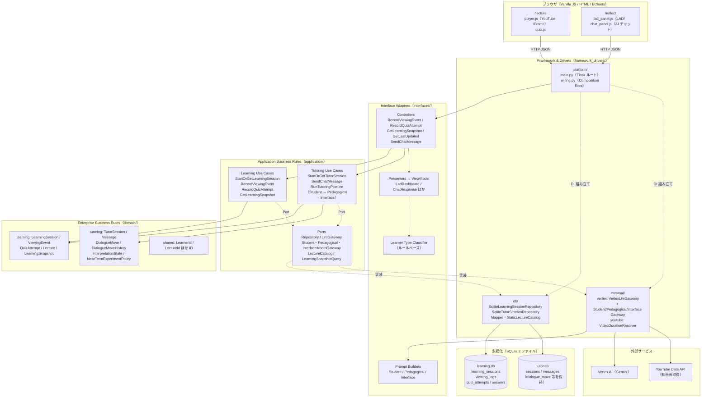
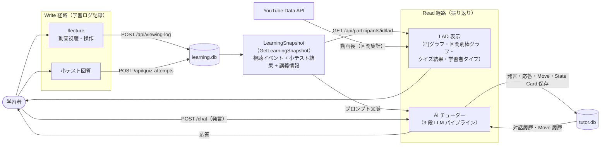
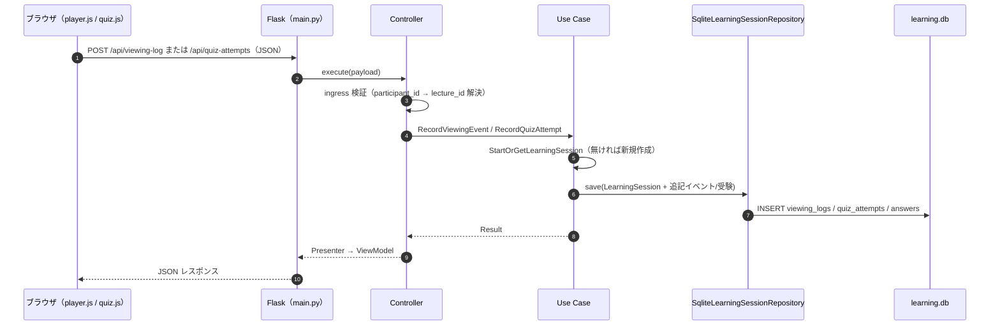
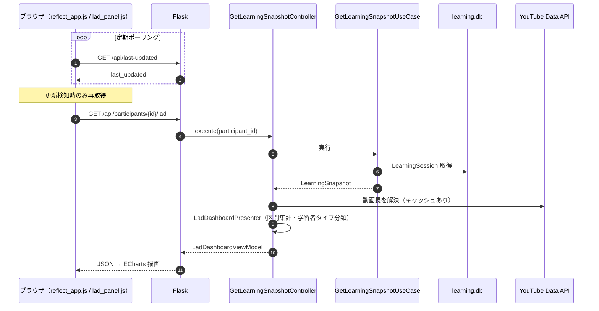
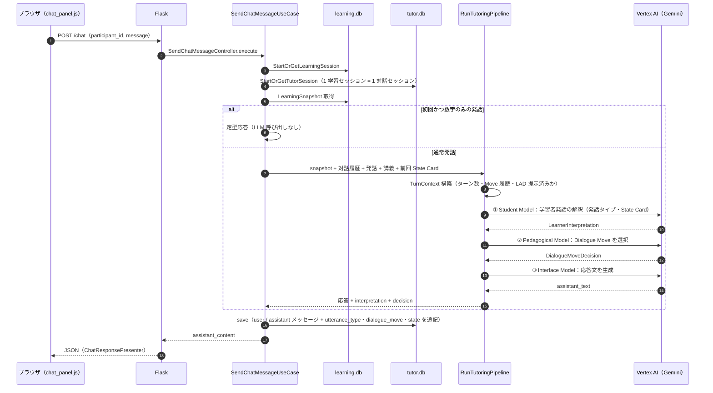

# システム概要仕様（アーキテクチャ構成図・データフロー図）

自己調整学習（SRL）支援システム。学習者が講義動画を視聴・小テストを受験し、その行動ログ（LAD）を見ながら AI チューターと振り返る。

本書は次の 2 要素のみを扱う。

- アーキテクチャ構成図
- データフロー図

## 1. アーキテクチャ構成図

クリーンアーキテクチャ 4 層 + 外部システム。依存は常に外側 → 内側（`domain` は何にも依存しない）。

### 構成要素の責務

| 層 | パス | 責務 |
| --- | --- | --- |
| Framework & Drivers | `framework_drivers/platform` | Flask ルート、HTML/静的 JS 配信、DI 組み立て（Flask を import してよい唯一の場所） |
| | `framework_drivers/db` | SQLite Repository・Mapper、講義カタログ・クイズ定義 |
| | `framework_drivers/external` | Vertex AI 呼び出し、YouTube 動画長取得 |
| Interface Adapters | `interfaces/` | 入力検証（ingress）、Controller、Presenter/ViewModel、LLM プロンプト構築、学習者タイプ分類 |
| Application | `application/` | Use Case と Port（抽象）定義。Result 型でエラーを返す |
| Domain | `domain/` | 集約・値オブジェクト・ドメインサービス（外部依存なし） |

### HTTP エンドポイント

| ルート | 種別 | 用途 |
| --- | --- | --- |
| `GET /lecture` | 画面 | 講義動画 + 小テスト |
| `GET /reflect` | 画面 | LAD + AI 振り返り |
| `POST /api/viewing-log` | Write | 視聴イベント記録 |
| `POST /api/quiz-attempts` | Write | 小テスト受験記録 |
| `GET /api/participants/<id>/lad` | Read | LAD ViewModel |
| `GET /api/last-updated` | Read | 学習データ最終更新時刻（ポーリング用） |
| `POST /chat` | Write/Read | AI チューター応答生成 |

## 2. データフロー図

### 2.1 全体データフロー（`participant_id` を共通キーとした Write / Read）

同一の `LearningSnapshot` を LAD と AI の双方が参照するため、学習直後に両者が同じ学習コンテキストを見る。

### 2.2 視聴ログ・小テスト記録（Write）

### 2.3 LAD 表示（Read・ポーリング）

### 2.4 AI チューター応答生成（`POST /chat`）

## 3. データストア構成

| DB | 主なテーブル | 書き込み元 | 読み取り先 |
| --- | --- | --- | --- |
| `learning.db` | `learning_sessions`（learner × lecture で一意）、`viewing_logs`、`quiz_attempts`、`quiz_attempt_answers` | 視聴ログ API・小テスト API | LAD API、`/chat`（Snapshot 経由） |
| `tutor.db` | `sessions`（`learning_session_id` で紐づけ）、`messages`（`utterance_type` / `dialogue_move` / `interpretation_state` 付き） | `/chat` | `/chat`（対話履歴・Move 履歴・前回 State Card） |

パスは環境変数 `LEARNING_DB_PATH` / `TUTOR_DB_PATH` で上書き可能（既定は `db/data/`）。
